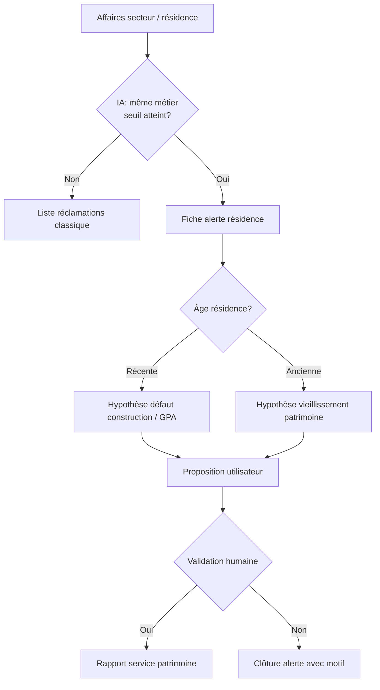

# LE LOCATAIRE — Notes de projet

Document de synthèse regroupant les **résumés de fin de session** (assistant + développement backend).  
Dernière mise à jour : **16 mai 2026**.

---

## 0. Public du document et mode d’échange

Le porteur du projet **n’est pas développeur**. Il peut à tout moment demander des **explications en langage simple** sur un terme technique, une étape de travail, un choix d’architecture ou ce que signifie concrètement une livraison — afin de bien comprendre avant de valider la suite.

**Attentes vis-à-vis de l’assistant (Cursor)** :

- Privilégier le **pourquoi métier / produit** avant le **comment technique**.
- Définir les acronymes et mots techniques à la **première occurrence** (ex. API, migration, push, stub, JWT).
- Utiliser des **exemples concrets** (parcours locataire, bailleur 2terHabitat, notification sur le téléphone).
- Éviter d’enchaîner du jargon sans pause ; proposer « je détaille si besoin » sur les points sensibles.
- Ne pas supposer que le vocabulaire du code est évident pour tout le monde.

**Pour le porteur du projet** : aucune question n’est « trop basique » — mieux vaut clarifier un point (ex. « c’est quoi une migration ? », « pourquoi Groq ? ») que valider à l’aveugle.

---

## 1. Vision produit (rappel)

Application **technique multilingue** (Guyane) pour locataires et bailleurs : le locataire signale un désordre (texte + photo) ; plusieurs **IA** classifient et routent la réclamation (charge bailleur, locatif, social, non recevable) pour **limiter les déplacements** du technicien / responsable de site.

- **Prestataires** : pas de gestion complète dans l’app en V1 ; les demandes d’artisan « à charge locataire » partent vers l’**owner** (admin plateforme), pas le marché des bailleurs.
- **Multilingue / avatar 2D** : prévu plus tard (créole, espagnol, anglais, brésilien).
- **Extensions futures** (sans casser le socle) : enquêtes OPS/SLS, relances obligatoires bailleur, assurances, **modules activables par bailleur** (feature flags côté admin).

**Stack backend** : `mon-backend/backend` — NestJS 11, Prisma 5, PostgreSQL (Supabase), JWT, Swagger.  
**Frontends** (hors scope des sprints ci-dessous) : `admin-dashboard`, `web-admin`, `web-bailleur`, `mobile/flutter`.

**Commandes utiles** (toujours depuis `mon-backend/backend`) :

```powershell
cd "C:\Users\ewald\Desktop\LE LOCATAIRE\mon-backend\backend"
npx prisma migrate deploy
npx prisma generate
npm run build
npm run start:dev
```

Swagger : `http://localhost:3000/api`

---

## 2. Décisions produit validées (cadrage initial)

| # | Sujet | Décision |
|---|--------|----------|
| Q1 | Multi-tenant | Filtrage applicatif strict (`landlordProfileId` / scope JWT) |
| Q2 | Hiérarchie | `Bailleur → Agence (optionnel) → Agent` ; permissions fines plus tard |
| Q3 | Onboarding locataire | Self-service : choix du bailleur, compte en attente, validation bailleur |
| Q4 | Escalade IA | **2 essais** max → escalade bailleur (`ESCALADE_BAILLEUR`) |
| Q5 | Vidéos | Archive interne d’abord (stub), YouTube en Sprint 8+ |
| Q6 | Non recevables | Traçabilité + message locataire ; compteur bailleur plus tard |
| Q7 | Artisans flow locataire | Ticket vers admin (owner), pas module `artisans/` bailleur |
| Q8 | Numéro dossier locataire (`DOS-XXXXXX`) | **Permanent** pour un même compte / même bailleur, même en cas de déménagement |
| Q9 | Numéro affaire (`AFF-AAAA-XXXXXX`) | **Un par demande** (ticket) |
| Q10 | Immatriculation logement (`LOG-CP-XXXXXX`) | **Unique** par logement (code postal + identifiant interne) ; visible sur le dossier et l’historique |
| Q11 | Changement de logement | Le **DOS** et l’**historique des demandes** sont conservés ; les tickets passés portent la mention « ancien logement » |
| Q12 | Fin d’occupation | Date de fin = **état des lieux de sortie** (`TenantHousingHistory.to`, motif `ETAT_DES_LIEUX_SORTIE`) |
| Q13 | Numéros locataire existants chez le bailleur | **Alignement par fichier** (import initial + mises à jour) : le numéro bailleur devient la référence métier affichée et recherchable ; un identifiant technique interne reste possible pour l’historique et les échanges API |
| Q14 | Un seul numéro « client » côté bailleur | Pas de double saisie : recherche dossier, exports et écrans bailleur utilisent le **numéro bailleur** ; le `DOS-…` auto-généré ne s’affiche qu’en secours si aucun numéro importé |

**Import bailleur (à coder — cadrage)** :

- Fichier CSV/Excel fourni par l’organisme (colonnes minimales : `numero_locataire_bailleur`, `nom`, `prenom`, `email` ou `telephone`, `ref_logement` = `LOG-…` ou adresse, optionnel `date_fin_occupation` / EDL sortie).
- Règle : **à la création ou à la première synchro**, si `numero_locataire_bailleur` est présent → il est enregistré comme référence officielle du dossier pour cet organisme (unicité **par bailleur**, pas globale).
- Recherche : `GET /tickets/lookup/dossier/:ref` accepte indifféremment le numéro bailleur ou le `DOS-…` interne.
- Logements : même logique possible avec `externalRef` / `LOG-…` déjà prévus sur `Housing`.

| Q15 | Parcours technicien référent | **Une seule affaire (`AFF-…`) = un fil unique** : toutes les actions (RDV, questions, photos, validation travaux, paiement entreprise) se font **dans le même ticket**, sans modules éparpillés |
| Q16 | Options sans dispersion | Plusieurs **types d’action** possibles sur une affaire, mais **un seul écran / une seule timeline** côté référent et côté locataire (comme la conversation Lia, puis reprise humaine) |
| Q17 | Rôle référent | Profil **AGENT** (ou équivalent) rattaché bailleur/agence : peut prendre en charge une affaire assignée ; le bailleur voit la même timeline en lecture |

**Fil d’affaire — actions prévues (cadrage, à coder par phases)** :

| Action référent | Effet locataire (app) | Socle technique déjà présent |
|-----------------|----------------------|------------------------------|
| Proposer un **rendez-vous** | Notification + accepter / proposer autre créneau | `PlanningSlot`, champs `slotProposedAt` / `slotConfirmedAt` sur `ArtisanRequest` |
| Poser des **questions** complémentaires | Message dans le fil ; réponse texte/photo | `TicketMessage` (étendre rôles : référent humain, pas seulement Lia) |
| Demander **photos** (réception travaux, complément sinistre) | Statut « en attente de votre photo » + upload | `AWAITING_TENANT_PHOTO`, `Document` sur ticket |
| **Valider réception** des travaux | Demande photos avant clôture ; le référent valide | Nouvelle étape métier sur ticket + trace horodatée |
| Déclencher **paiement entreprise** | Optionnel : accusé « intervention terminée » | `Invoice` + statut `ArtisanRequest` ; paiement hors app ou lien compta selon choix bailleur |

**Règle d’or** : ne pas créer d’écrans « RDV », « chat sinistre », « photos » séparés — tout est une **timeline d’événements** sur `AFF-…`, avec boutons d’action contextuels selon l’étape (diagnostic → intervention → réception → clôture).

| Q18 | Page réclamations — référent de secteur | **Page dédiée** (route prévue : `/agent/reclamations` ou `/referent/reclamations`) : liste des affaires du **périmètre agence/secteur** (`AgentProfile.agenceId` → `Housing.agenceId`) |
| Q19 | Colonnes liste référent | **N° dossier** (numéro bailleur ou `DOS-…`), **N° affaire** (`AFF-…`), **métier** (catégorie IA / corps de métier : plomberie, électricité, etc.), **jours sans traitement**, statut, logement, locataire |
| Q20 | Affichage « jours sans traitement » | **`0`** → style normal (pas de retard affiché). **`> 0`** → affichage **`+N`** en **rouge** (ex. `+3` = 3 jours sans action humaine sur l’affaire). Tri par défaut : retard décroissant |
| Q21 | Définition « sans traitement » | Nombre de jours calendaires depuis la **dernière action humaine** sur l’affaire (message référent, changement statut, RDV, demande photo, validation) ; si aucune action humaine : depuis `Ticket.createdAt` (ou depuis fin analyse Lia si ticket encore `LIA_ANALYZING`) |
| Q22 | Suivi référent | Filtres : *mes prises en charge*, *à traiter*, *en attente locataire*, *en attente entreprise* ; accès direct au **fil AFF** pour agir (cf. Q15–Q17) |
| Q23 | Vision bailleur (pilotage) | Même données agrégées + **tableau de bord** : actions réalisées, **affaires en retard** (`joursSansTraitement > 0`), **secteurs (agences) défaillants** (taux / nombre de `+N` élevés, délai moyen). Route prévue : `/bailleur/pilotage-reclamations` |
| Q24 | Secteur défaillant | Agence / secteur dont le **nombre d’affaires en retard** ou le **délai moyen** dépasse un seuil configurable par bailleur (paramètre admin à définir) |

**Écrans (cadrage UI)**

| Profil | Page | Contenu principal |
|--------|------|-------------------|
| **Référent secteur** (`AGENT`) | Réclamations secteur | Table : dossier · affaire · métier · `+jours` · statut · bouton *Ouvrir* |
| **Bailleur** | Pilotage réclamations | KPI + liste globale + **classement secteurs** (retards, actions faites sur 7/30 j) |

**Données backend à prévoir** (non encore codées) :

- `Ticket.assignedAgentId` (prise en charge par un référent).
- `Ticket.lastHumanActionAt` (horodatage dernière action hors IA automatique).
- `GET /agents/me/reclamations` — liste scopée agence, champs calculés : `dossierNumber`, `caseNumber`, `metier`, `joursSansTraitement`, `affichageRetard` (`"0"` \| `"+N"`).
- `GET /landlords/me/reclamations/pilotage` — agrégats par agence + liste des retards.

**CSS (règle affichage)** : classe `.retard-jours--ok` (couleur texte normale) pour `0` ; `.retard-jours--alert` (rouge, graisse) pour `+N`.

| Q25 | IA analyse par secteur / résidence | Dans la **même section** réclamations (référent + pilotage bailleur), une **IA de corrélation** détecte les **signaux faibles répétés** sur une résidence + un métier, et ouvre une **fiche alerte patrimoine** dédiée (pas un écran isolé) |
| Q26 | Déclenchement | Seuil configurable (ex. **≥ 3 affaires** sur **30 jours**, même `residenceId` ou même immeuble, même famille de métier : `FUITE_TOITURE`, `PORTE_INTERIEURE`, `SANITAIRE`, etc.) |
| Q27 | Page alerte IA | Titre du type : *« Résidence XXX — plusieurs réclamations [métier] »* ; liste des `AFF-…` liées ; **hypothèse IA** + **proposition d’action** ; boutons : *Valider et transmettre au patrimoine*, *Écarter*, *Demander expertise* |
| Q28 | Hypothèses selon âge du bâti | Si `HlmResidence.residenceNeuve` ou livraison récente → piste **défaut de construction / GPA** ; sinon → piste **vieillissement / entretien patrimonial** ; l’IA cite les dates GPA / biennale / décennale si connues |
| Q29 | Exemples métier (non exhaustif) | **Fuites toiture** (plusieurs logements) → rapport patrimoine toiture / étanchéité. **Portes intérieures sèches** → vieillissement boiseries / humidité résidence. **Sanitaires** (fuites récurrentes, dégâts) → réseau collectif ou vétusté installations |
| Q30 | Remontée patrimoine | Génération d’un **rapport structuré** (PDF ou JSON + export) adressé au **service patrimoine** : résidence, métier, N affaires, hypothèse, recommandation, photos agrégées ; statut `PATRIMOINE_SIGNALE` sur les tickets du cluster |
| Q31 | Rôle humain | L’IA **propose**, le référent ou le bailleur **valide** avant envoi patrimoine ; traçabilité dans la timeline (événement `PATRIMOINE_REPORT_SENT`) |
| Q32 | Lien socle HLM | S’appuyer sur `Housing.hlmLogementId` → `HlmLogement.residenceId` → `HlmResidence` (`constructionYear`, `residenceNeuve`, garanties) ; sans lien HLM : regroupement par **adresse / résidence saisie** côté bailleur |

**IA corrélation — flux (cadrage)**



**Données backend à prévoir** (complément Q18–Q24) :

- `PatrimoineAlert` (ou `ResidenceClaimCluster`) : `residenceId`, `metier`, `ticketIds[]`, `hypothesis`, `recommendation`, `status`, `createdByAiAt`, `validatedByUserId`, `sentToPatrimoineAt`.
- Job planifié ou analyse à la volée sur `GET …/reclamations` : détection clusters + badge *« 1 alerte IA »* sur la page réclamations.
- Service `PatrimoineInsightService` : règles métier + LLM pour rédiger le texte de proposition (s’appuie sur `AiMemory` résidence / décrets si besoin).
- Routes : `GET /agents/me/reclamations/insights`, `GET /landlords/me/reclamations/insights`, `POST …/insights/:id/validate`, `POST …/insights/:id/send-patrimoine`.

**Affichage UI** : encart ou onglet **« Analyses IA »** dans la page réclamations (référent + bailleur), sans quitter la section — cohérent avec Q15–Q16 (pas de dispersion).

| Q33 | Dashboard **Patrimoine** | Espace dédié **« Patrimoine »** (menu principal) : **toutes les réclamations** et **alertes IA** référencées et navigables par **agence → secteur → résidence** ; distinct du pilotage « réclamations terrain » (référent) mais alimenté par les mêmes `AFF-…` |
| Q34 | Hiérarchie de navigation | **Niveau 1 — Agence** (entité `Agence`) → **Niveau 2 — Secteur** (sous-zone : champ optionnel `secteur` sur `Housing` / regroupement géographique, ou = agence si structure plate) → **Niveau 3 — Résidence** (`HlmResidence` ou libellé résidence saisi) → **Niveau 4 — Logements / affaires** (`LOG-…`, liste `AFF-…`) |
| Q35 | Contenu dashboard Patrimoine | Par niveau : compteurs (affaires ouvertes, en retard `+N`, alertes IA actives, rapports envoyés) ; drill-down jusqu’au détail affaire ; filtres métier, période, statut patrimoine |
| Q36 | Page **gestion interne** Patrimoine | Sous-route `/patrimoine/gestion` (ou `/patrimoine/interne`) : file des **rapports à traiter**, alertes IA validées, dossiers GPA / vieillissement, assignation chargé de mission, statuts internes (*reçu*, *en analyse*, *programmé*, *clôturé*), notes et pièces jointes — **réservé au service patrimoine** (rôle dédié ou permission bailleur) |
| Q37 | Alimentation | Les réclamations remontées depuis les référents (Q30) et les **clusters IA** (Q25–Q31) apparaissent automatiquement dans le dashboard Patrimoine ; une affaire peut être vue à la fois côté référent (opérationnel) et côté patrimoine (structurant) |
| Q38 | Module activable | Feature flag bailleur `patrimoineModule` (comme les autres modules Sprint 6) : masqué si l’organisme n’a pas de service patrimoine dans l’app |

**Dashboard Patrimoine — arborescence (cadrage UI)**

```
/patrimoine                          → Vue globale bailleur (KPI + carte secteurs)
/patrimoine/agences/:agenceId        → Agence
/patrimoine/agences/:id/secteurs/:s  → Secteur (si utilisé)
/patrimoine/residences/:residenceId  → Résidence (liste logements + alertes IA)
/patrimoine/residences/:id/affaires  → Toutes les AFF de la résidence
/patrimoine/gestion                  → Gestion interne (file de travail patrimoine)
/patrimoine/gestion/rapports/:id     → Détail rapport / alerte cluster
```

**Rôles et accès**

| Profil | Dashboard Patrimoine | Gestion interne |
|--------|---------------------|-----------------|
| **Service patrimoine** (rôle `PATRIMOINE` ou `AGENT` + permission) | Lecture + drill-down complet | **Écriture** (statuts, assignation, clôture) |
| **Bailleur / direction** | Lecture + KPI secteurs défaillants | Lecture (supervision) |
| **Référent secteur** | Lecture résidences de son périmètre | Pas d’accès (sauf si double casquette) |

**Données backend à prévoir** (complément)

- `PatrimoineCase` : lien `PatrimoineAlert` / rapport + `residenceId` + `agenceId` + statut workflow interne + `assignedToUserId`.
- `GET /patrimoine/dashboard` — agrégats par agence / secteur / résidence.
- `GET /patrimoine/residences/:id/reclamations` — toutes les AFF + métadonnées retard + liens cluster IA.
- `GET|PATCH /patrimoine/gestion/cases` — file gestion interne (CRUD statuts, commentaires).
- Indexation : chaque `Ticket` exposé avec `agenceId`, `residenceId` (dénormalisé à la création pour perfs).

**Cohérence produit** : trois volets complémentaires, **une seule source** (`Ticket` / `AFF-…`) :

| Volet | Public | Question à laquelle il répond |
|-------|--------|----------------------------|
| **Réclamations secteur** (`/agent/reclamations`) | Référent | *Que dois-je traiter aujourd’hui ?* (`+N` rouge) |
| **Pilotage bailleur** (`/bailleur/pilotage-reclamations`) | Direction / bailleur | *Quels secteurs sont en retard ?* |
| **Dashboard Patrimoine** (`/patrimoine`) | Service patrimoine | *Où sont les problèmes structurels par résidence ?* + gestion des rapports |

---

## 3. Historique Git (backend — branche `main`)

| Commit | Sprint | Message |
|--------|--------|---------|
| `7c7fd290` | — | Version stable : Auth OK |
| `ad221bdc` | **1** | feat(backend): fondation multi-tenant SaaS (sprint 1) |
| `0638fdeb` | **2** | feat(backend): onboarding locataire self-service (sprint 2) |
| `9551f5da` | **3** | feat(backend): routage automatique IA des tickets locataire (sprint 3) |
| `924b5406` | **4** | feat(backend): vidéothèque IA + demandes d'artisan (sprint 4) |
| `0a2f14ea` | **5** | feat(backend): backoffice volet social — cas, référents, journal (sprint 5) |
| `79a6bc62` | **6** | feat(backend): notifications réelles SMTP/FCM + feature flags bailleur (sprint 6) |
| `8afc7698` | **D** | feat: dashboard bailleur IA et escalades (sprint D) |

Migrations Prisma associées (dossier `mon-backend/backend/prisma/migrations/`) :

- `20260514103000_multitenant_foundation`
- `20260514120000_tenant_registration_request`
- `20260514150000_ai_ticket_routing`
- `20260514190000_video_library_and_artisan_requests`
- `20260515100000_social_case_backoffice`
- `20260515120000_notifications_and_feature_flags`
- `20260515140000_lia_conversation` (Sprint F)

---

## 4. Résumés par session

### Session 0 — Analyse initiale & feuille de route (14 mai 2026)

**Contexte** : reprise du projet après accumulation de code non commité ; analyse du dépôt et du fichier `Processus application.xlsx`.

**Constats** :

- Deux modèles parallèles (annuaires `Bailleur` / `Locataire` / `BienImmobilier` vs métier `LandlordProfile` / `TenantProfile` / `Housing`).
- Modules legacy opérationnels (auth, admin, HLM, IA diagnostics, tickets, etc.).
- Risque : pas de commit récent, migrations à synchroniser avec Supabase.

**Décisions** : valider le plan en 6 sprints (multi-tenant → onboarding → IA → vidéos/artisan → social → …).  
**Suite** : Sprint 1 après sauvegarde git.

---

### Sprint 1 — Fondation multi-tenant SaaS

**Commit** : `ad221bdc`

**Livré** :

- Suppression des annuaires doublons (`Bailleur`, `Locataire`, `BienImmobilier`).
- `ContratLocation` / `Paiement` reliés à `LandlordProfile`, `TenantProfile`, `Housing`.
- Modèles `Agence`, `AgentProfile` ; rôle **`AGENT`**.
- **`BailleurScope`** : types, service, guard, décorateur `@BailleurScope()`.
- Filtre multi-tenant sur **contrats** et **paiements** (ADMIN / BAILLEUR / AGENT).
- Migration `20260514103000_multitenant_foundation` ; build OK ; serveur démarre.

**Git** : `.gitignore` enrichi (backend + racine : `projet.txt`, `~$*`, artefacts debug).

---

### Sprint 2 — Onboarding locataire self-service

**Commit** : `0638fdeb`  
**Migration** : `20260514120000_tenant_registration_request`

**Livré** :

- Modèle **`TenantRegistrationRequest`** (PENDING / APPROVED / REJECTED).
- **Public** : `GET /landlords/public`, `POST /auth/register-tenant` (`isAvailable=false`).
- **Bailleur / agent** : liste, détail, approve, reject (`/landlords/me/tenant-requests/...`).
- À l’approbation : création `TenantProfile` + `Housing`, activation compte, notifications.

---

### Sprint 3 — Routage automatique IA des tickets

**Commit** : `9551f5da`  
**Migration** : `20260514150000_ai_ticket_routing`

**Livré** (cœur produit) :

- Enrichissement **`Ticket`** : `responsibility`, `nonRecevableReason`, `aiAttempts`, `aiMaxAttempts` (2), `escalatedAt`, `aiLastDecision`, `landlordProfileId`.
- Statuts : `NEW`, `AWAITING_TENANT_PHOTO`, `AUTO_CLOSED`.
- Module **`ai-routing/`** (port hexagonal + stub déterministe FR).
- À la création d’un ticket : pipeline IA + notifications + trace **`AiDiagnostic`**.
- Cas **SOCIAL** : création **`SocialCase`** + notif bailleur.
- Endpoints : `redo-photo`, `tenant-feedback`, `request-human-review`, `ai-analyze`, `GET /tickets/me/routed`.

**PRD** : seuil confiance 0,75 ; `AUTO_CLOSED` réouvrable ; escalade après 2 tentatives.

---

### Sprint 4 — Vidéothèque IA + demandes d’artisan

**Commit** : `924b5406`  
**Migration** : `20260514190000_video_library_and_artisan_requests`

**Livré** (après décision IA **`LOCATAIRE`**) :

1. **Vidéos** : `VideoTutorialQuery`, `VideoTutorial`, `TicketVideoSuggestion` ; module **`video-library/`** (stub 6 catégories, cache hit/miss).
2. **Artisan** : `ArtisanRequest` → backoffice **admin** (owner), pas le module `artisans/` bailleur.
3. Endpoints locataire : vidéos, feedback, `mark-resolved-by-video`, `POST /tickets/:id/artisan-request`.
4. Admin : `/admin/artisan-requests`, `/admin/video-library`.
5. Bailleur : `GET /landlords/me/artisan-requests` (lecture seule).
6. **P4** : pas de fourchette de prix — message « un devis vous sera proposé ».

Branchement : après routage `LOCATAIRE`, suggestion automatique de tutoriels.

---

### Sprint 5 — Backoffice volet social

**Commit** : `0a2f14ea`  
**Migration** : `20260515100000_social_case_backoffice`  
**PRD validé** : P1–P6 (défauts).

**Livré** :

- **`SocialCase`** : affectation référent, priorité, clôture (`closedReason` obligatoire), `lastContactAt`.
- **`SocialCaseEvent`** : journal append-only.
- **`SocialWorker`** : `@@unique([userId, bailleurId])` ; rôles COORDINATOR / FIELD / EXTERNAL.
- Module **`social/`** activé dans `AppModule`.
- **P1** : accès référent via table `SocialWorker` + `SocialWorkerGuard` (pas de rôle JWT dédié).
- **P2** : bailleur et agent peuvent gérer les dossiers de leur organisme.
- **P3** : locataire voit statut + message générique (`GET /tenant/me/social-case`), pas les notes internes.
- **P4** : clôture dossier → ticket lié en `RESOLVED`.
- **P5** : notes en append horodaté `[date UTC user#id]`.
- **P6** : référent = utilisateur existant uniquement.

**API** :

| Rôle | Routes principales |
|------|-------------------|
| ADMIN | `/admin/social-cases` |
| BAILLEUR / AGENT | `/landlords/me/social-cases`, `/landlords/me/social-workers` |
| Référent social | `/social/me/cases` (dossiers assignés) |
| LOCATAIRE | `/tenant/me/social-case` |

---

### Sprint 6 — Notifications réelles + feature flags bailleur

**Commit** : `79a6bc62`  
**Migration** : `20260515120000_notifications_and_feature_flags`

**6B — Notifications** :

- Ports hexagonaux **email** (SMTP si `SMTP_HOST`, sinon log console) et **push** (FCM si credentials Firebase, sinon log console).
- `notifyUser()` : in-app + email + push selon `UserNotificationSettings`.
- `createNotification()` délègue à `notifyUser()` (rétrocompatibilité modules existants).
- Modèles : `UserNotificationSettings`, `DevicePushToken`, `Notification.readAt`.
- Endpoints : `GET/PATCH /notifications/me/settings`, `POST/DELETE /notifications/me/device-tokens`, `PATCH /notifications/:id/read`.

**6A — Feature flags** :

- Modèle `LandlordFeatureFlags` (9 booléens par module).
- Admin : `GET/PATCH /admin/landlords/:id/feature-flags`.
- Bailleur : `GET /landlords/me/feature-flags` (lecture seule).
- Garde `LandlordModuleGuard` + `@RequiresLandlordModule('socialModule')` sur les routes sociales bailleur.
- Création auto des flags à la création d’un bailleur (admin).

**Variables d’environnement** (optionnelles) :

| Variable | Rôle |
|----------|------|
| `SMTP_HOST`, `SMTP_PORT`, `SMTP_USER`, `SMTP_PASS`, `SMTP_FROM` | Email réel |
| `NOTIFICATIONS_EMAIL_ENABLED=false` | Désactive l’email (garde in-app + push) |
| `FIREBASE_PROJECT_ID`, `FIREBASE_CLIENT_EMAIL`, `FIREBASE_PRIVATE_KEY` | FCM |
| `GOOGLE_APPLICATION_CREDENTIALS` | Chemin JSON service account (alternative) |
| `NOTIFICATIONS_PUSH_ENABLED=false` | Désactive le push |

**Dépendances** : `nodemailer`, `firebase-admin`.

**Tests** : `npx prisma migrate deploy` OK · `npm run build` OK.

---

### Sprint D — Dashboard bailleur (stats IA + escalades)

**Commit** : `8afc7698`

**Livré** :

- **`GET /landlords/me/dashboard`** (BAILLEUR, AGENT) : KPI parc, factures, compteurs par `responsibility` et `status`, escalades actives, stats IA (confiance moyenne, catégories), derniers tickets.
- **`GET /landlords/me/tickets?responsibility=`** — filtre optionnel (agents supportés via `BailleurScope`).
- **admin-dashboard** : tableau de bord enrichi, filtres sur la liste tickets, badges responsabilité.

---

### Sprint F — Lia (conversation async + hôte d’accueil)

**Migration** : `20260515140000_lia_conversation`  
**Contexte** : le locataire peut **fermer l’app dès le 1er message** et revenir sur **push** ; pas d’attente bloquante sur l’analyse patho/juriste.

**Livré (backend)** :

- Modèles **`TicketMessage`** (rôles `TENANT`, `LIA_HOST`, `LIA_SYSTEM`), **`AiMemory`** (RAG juriste — structure prête), statut ticket **`LIA_ANALYZING`**.
- Module **`src/lia/`** : `LiaHostService` (Groq / fallback FR), `LiaOrchestratorService` (accueil synchrone + `analyzeTicket` en arrière-plan).
- **`POST /tickets`** : retourne le ticket + `messages` (accueil immédiat).
- **`GET /tickets/:id/messages`**, **`POST /tickets/:id/messages`** (locataire).
- Variables : `GROQ_API_KEY`, `LIA_HOST_MODEL`, `LIA_HOST_ENABLED` (voir `.env.example`).

**Décisions produit** :

| Sujet | Décision |
|--------|----------|
| Fermeture app après 1er message | **Oui** — push à la fin d’analyse |
| Contexte bailleur social | **2terHabitat** (fusion SIGUY/SIMKO, effetif 1er janv. 2026) — pas de références SIGUY/SIMKO dans le code |
| Agents cibles (phases suivantes) | Hôte Groq → Pathologiste Gemini → Juriste Mistral + `AiMemory` → orchestrateur NestJS |

**Livré (compléments 16 mai 2026)** :

- Push FCM : champ `ticketId` dans le payload `data` (accueil Lia + fin d’analyse).
- Anti-doublon : une seule analyse async à la fois par ticket.
- Flutter : `PushHandlerService` + `NotificationNavigation` persistante (SharedPreferences) ; `FcmService` prêt (`firebase_options.dart` — activer après `flutterfire configure`).
- Conversation : bouton « Prendre une photo » si `AWAITING_TENANT_PHOTO` → `redo-photo`.

**Suite** : FCM prod, multilingue, enrichir `AiMemory` (embeddings).

---

### Sprint G — Pathologiste + juriste (pipeline Lia)

**Contexte** : remplacer le stub mots-clés par une chaîne en 2 agents, testable en **simulation** sans vrais locataires.

**Livré (backend)** :

- **`AI_PIPELINE_MODE`** : `lia` (défaut), `stub`, ou `auto` (lia si clés API).
- **`LiaPathologistService`** : Gemini Vision si `GEMINI_API_KEY`, sinon simulation (fuite, électricité, etc.).
- **`LiaJuristService`** : Mistral + extraits `AiMemory` si `MISTRAL_API_KEY`, sinon règles + mémoire.
- **`AiPipelineLiaAdapter`** : pathologiste → juriste ; repli stub si échec.
- **`AiMemoryService`** : recherche RAG par mots-clés (bailleur + global).
- Scripts : `scripts/seed-ai-memory.ts`, `scripts/test-sprint-g.ps1`.
- Variables : voir `.env.example` (`GEMINI_*`, `MISTRAL_*`, `AI_PIPELINE_MODE`).

**Simulation locale (sans clés API)** :

```powershell
cd mon-backend/backend
npx ts-node scripts/seed-lia-demo.ts
npx ts-node scripts/seed-ai-memory.ts
# AI_PIPELINE_MODE=lia par défaut — pathologiste/juriste en mode simulation
npm run start:dev
.\scripts\test-sprint-g.ps1
```

**Avec vrais LLM** : renseigner `GEMINI_API_KEY` et/ou `MISTRAL_API_KEY`, redémarrer le serveur.

**Flutter (Sprint F — UI)** :

- `TicketConversationScreen` — fil bulles locataire / Lia, bandeau « Lia analyse… », envoi de messages, photo.
- `MyTicketsScreen` — liste `GET /tickets/me`.
- Création ticket → redirection conversation (`POST /tickets` + `messages`).
- `TenantService` — logement via `GET /tenant/me` (plus de `housingId: 1` en dur).
- FCM prod : `flutterfire configure` → `DefaultFirebaseOptions.isConfigured = true` + `google-services.json` / `GoogleService-Info.plist`.

---

## 5. Prochaines étapes suggérées (non encore codées)

| Priorité | Thème | Description |
|----------|--------|-------------|
| ~~A~~ | ~~Feature flags par bailleur~~ | **Fait** |
| ~~B~~ | ~~Notifications réelles~~ | **Fait** — prod : SMTP/FCM |
| ~~D~~ | ~~Dashboard bailleur~~ | **Fait** |
| ~~F~~ | ~~Lia / LLM (conversation)~~ | **Fait** |
| ~~G~~ | ~~Pathologiste + juriste~~ | **Fait** — Gemini/Mistral optionnels + simulation |
| C | **Multilingue + avatar 2D** | Locales + guide UX |
| E | **YouTube Data API** | Remplacer stub vidéo |
| G | **Compliance OPS / SLS** | Extension social |
| H | **Assurances / relances** | Modèles séparés |

---

## 6. Points d’attention techniques

- **Répertoire Prisma** : `mon-backend/backend` (pas `mon-backend` seul).
- **DTO bailleur (Swagger)** : `AdminUpdateLandlordDto` (admin) et `LandlordUpdateProfileDto` (bailleur `PATCH /me`) — plus de doublon `UpdateLandlordDto`.
- **Prod notifications** : modèle dans `mon-backend/backend/.env.example` (SMTP + Firebase).
- **Feature flags** : `@RequiresLandlordModule` sur les contrôleurs métier ; ADMIN plateforme non bloqué.
- **Module `artisans/`** : reste pour prestataires bailleur / planning ; distinct de **`ArtisanRequest`** (owner).
- **Transcript sessions** (historique chat) :  
  `C:\Users\ewald\.cursor\projects\c-Users-ewald-Desktop-LE-LOCATAIRE-mon-backend-backend\agent-transcripts\`

---

## 7. Comment mettre à jour ce fichier

À **chaque fin de session** avec l’assistant (ou après un sprint livré), compléter ce document dans l’ordre suivant.

### Checklist rapide

1. Mettre à jour la date en tête : **« Dernière mise à jour »**.
2. Ajouter une ligne dans le **tableau §3** (commit + sprint) si un nouveau commit a été fait.
3. Ajouter ou compléter une sous-section dans **§4** (résumé de session).
4. Ajuster **§5** (prochaines étapes) : barrer ce qui est fait, ajouter la priorité suivante.
5. Si une décision produit a changé, mettre à jour **§2**.
6. Rappeler **§0** : réponses accessibles au porteur non développeur ; explications sur demande.

### Modèle à copier pour une nouvelle session

```markdown
### Sprint N — Titre court (JJ mois AAAA)

**Commit** : `hash12`  
**Migration** : `nom_migration` (ou « aucune »)

**Contexte** : une phrase sur l’objectif.

**Livré** :
- …
- …

**Endpoints principaux** :
- `MÉTHODE /chemin` — rôle(s)

**Décisions / PRD** : (si applicable)

**Tests** : build OK / migrate deploy OK / smoke serveur OK

**Suite proposée** : …
```

### Commit Git de ce fichier seul

Depuis la racine du dépôt `LE LOCATAIRE` :

```powershell
cd "C:\Users\ewald\Desktop\LE LOCATAIRE"
git add NOTE.md
git commit -m "docs: mise à jour NOTE.md (fin de session sprint N)"
```

Ne pas committer `projet.txt` ni les fichiers Office temporaires (`~$*`).

### Historique des mises à jour de ce document

| Date | Auteur | Changement |
|------|--------|------------|
| 15 mai 2026 | Session assistant | Création initiale : synthèse sessions 0–5 + roadmap |
| 15 mai 2026 | Session assistant | Sprint 6 : notifications (SMTP/FCM) + feature flags bailleur |
| 15 mai 2026 | Session assistant | Renommage DTO Swagger : `AdminUpdateLandlordDto` / `LandlordUpdateProfileDto` |
| 15 mai 2026 | Porteur projet | §0 ajouté : porteur non développeur, explications simples attendues |
| 16 mai 2026 | Session assistant | Sprint F clôturé : push ticketId, FCM hook Flutter, photo depuis conversation |
| 16 mai 2026 | Session assistant | Sprint G : pipeline pathologiste + juriste + AiMemory RAG |
