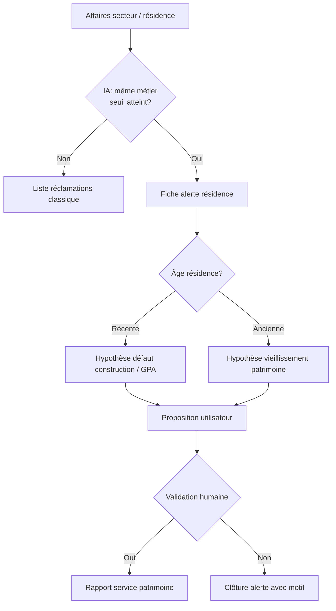

# LE LOCATAIRE — Notes de projet

Document de synthèse regroupant les **résumés de fin de session** (assistant + développement backend).  
Dernière mise à jour : **27 mai 2026**.

**SYSTÈME JARVIS OPÉRATIONNEL — MODE VISUALISATION & ESCALADE HUMAINE ACTIVÉ**

Lia n’est plus un programme de scripts linéaires : c’est un **Agent de Raisonnement Systémique** piloté par `lia-jarvis-intake.engine.ts` (+ `lia-jarvis-pilot.service.ts`).

| Pilier | Référence |
|--------|-----------|
| Visualisation 3D / flux | [`VISUAL_LOGIC.md`](VISUAL_LOGIC.md) — Exutoire (3 verres), Dalle froide R-1/R+1, Enveloppe R+6 |
| Dialogue locataire | Jarvis — extraction 360°, protocole Marie, Groq |
| Validation technique | DTU, CCTP, `panne-diagnostic-logique.json`, pipeline `ai-routing` |
| Sixième sens | Handoff `BAILLEUR_SECTOR_TECH` → `lia-jarvis-handoff.service.ts` |

**Manifeste produit / architecture IA** : voir [`MANIFESTE_FINAL.md`](MANIFESTE_FINAL.md) (rectification expert, Goals + SharedState, mapping stack réelle).

---

## V1 DU CŒUR TECHNIQUE : VALIDÉE ET TESTÉE

Le **moteur diagnostic** (Savoir-Voir + `DiagnosticContextService` + pipeline `ai-routing`) est **opérationnel** et **validé par test E2E mobile** (`npm run test:mobile-flow` — ticket **#42** au vert : `VERDICT_BAILLEUR`, champs Flutter `language`, `severity`, `sensors`, `legal_basis`, `avatar_action`).

| Bloc | Statut |
|------|--------|
| Contexte unifié | `DiagnosticContextService` — capteurs, intake, phases Savoir-Voir |
| Pipeline locataire | `ai-routing` + pathologiste + juriste + companion |
| Services satellites | Ticket, Dispatch, Quality, Support, Social, Legal, Insurance, Photo — **tous branchés** sur le contexte (plus de stubs MVP parallèles) |
| Volet social | `SocialCasesService` expose `triggerTicketDiagnostic` sur les fiches liées |
| Marchés d'entretien | Mapping `leadingHypothesisId` → contrats (`090cb665`) |
| Prochaine étape produit | **Carrosserie** : Avatar Lia + dashboards (référent, marchés, technicien) |

**Commande de non-régression cœur** : backend `npm run start:dev` + `npm run test:mobile-flow` (compte démo seed).

---

## Priorité en cours (22 mai 2026)

**Carrosserie produit** (après cœur validé) : **Avatar Lia** (animations, `avatar_action`) et **dashboards** (référent AGENT, Service des Marchés, technicien).

Les essais mobile de saisie restent utiles en non-régression (`test:mobile-flow`, checklist ci-dessous).

### Backlog noté (pas la priorité immédiate)

- **Notification push (FCM)** quand un référent **prend en charge** une affaire (`takeCharge` → statut `IN_PROGRESS`) : prévenir le locataire avec `ticketId` pour rouvrir le fil (même mécanisme que fin d’analyse Lia).

### Checklist essais — saisie réclamation (Flutter)

| # | Saisie test | Résultat attendu |
|---|-------------|------------------|
| 1 | Un sujet : *Fuite sous l’évier* | Un ticket → conversation Lia (message d’accueil visible) |
| 2 | Deux sujets : *Fuite au WC et plus d’électricité dans la cuisine* | Écran **Plusieurs problèmes** (2 cartes) |
| 3 | Après (2), ouvrir le 1er sujet puis revenir à l’accueil | Bandeau *Traiter le problème suivant* |
| 4 | Compte sans logement actif | Message : contacter le bailleur |
| 5 | Backend + seed démo | `npm run start:dev` puis `npm run test:mobile-flow` (script client simulé) |

**Compte démo** (si seed à jour) : `demo.locataire@lelocataire.test` / `DemoLocataire1!` — lancer backend + `flutter run` (Chrome ou téléphone sur le même Wi‑Fi, `config.dart` = IP du PC).

**Script backend** (détection multi-sujets sans l’app) : `npx ts-node scripts/test-detect-claims.ts` depuis `mon-backend/backend`.

### Référentiel réclamations (logement / bâtiment / résidence)

Document source : [`data/reclamations-locataires.json`](data/reclamations-locataires.json) (typologie + exemples + charge probable).  
Base juridique enrichie : [`data/legal-references.json`](data/legal-references.json) v2 (chauffage, ascenseur, VMC, nuisibles, serrure, parties communes, périmètre).

| Périmètre | Exemples de réclamations fréquentes | Charge type |
|-----------|-------------------------------------|-------------|
| **Logement** | Fuite évier, lumière SDB, pas d’eau chaude, radiateur froid, serrure, nuisibles dans le lot | Nuance locataire / bailleur (87-712) |
| **Bâtiment** | Infiltration toiture, colonne d’eau, ascenseur, VMC, hall/couloir, interphone | Bailleur (parties communes) |
| **Résidence** | Parking, espaces verts, laverie, portail | Bailleur |
| **Hors technique Lia** | Charges contestées, bruit de voisin | Admin / non recevable |

Après pull : `npx ts-node scripts/seed-legal-references.ts` et `npx ts-node scripts/seed-ai-memory.ts` puis `npx ts-node scripts/sync-legal-references-assets.ts`.

### Carte logique des pannes (IA Organisateur)

Fichier : [`data/panne-diagnostic-logique.json`](data/panne-diagnostic-logique.json) — **11 types de panne**, chaque cause avec :

- `probabilityGuyane` (ordre des questions, calibrage tropical / réseau / pluies)
- `discriminantQuestion` (une réponse peut écarter la piste)
- `danger` (CRITICAL → LOW)

Chargement backend : `loadPanneDiagnosticCatalog()`, `detectPanneFromText()`, `nextOrganizerCause()` dans `mon-backend/backend/src/lia/panne-diagnostic.loader.ts`.

**Intake réactif** : si un arbre est trouvé, `lia-intake-reactive` pose les `discriminantQuestion` du JSON (plus les listes fixes `INTAKE_QUESTIONS` / `INTAKE_LIGHTING_ELECTRICITY` pour ce dossier).

---

## 0. Public du document et mode d’échange

Le porteur du projet **n’est pas développeur**. Il peut à tout moment demander des **explications en langage simple** sur un terme technique, une étape de travail, un choix d’architecture ou ce que signifie concrètement une livraison — afin de bien comprendre avant de valider la suite.

**Attentes vis-à-vis de l’assistant (Cursor)** :

- Privilégier le **pourquoi métier / produit** avant le **comment technique**.
- Définir les acronymes et mots techniques à la **première occurrence** (ex. API, migration, push, stub, JWT).
- Utiliser des **exemples concrets** (parcours locataire, bailleur 2terHabitat, notification sur le téléphone).
- Éviter d’enchaîner du jargon sans pause ; proposer « je détaille si besoin » sur les points sensibles.
- Ne pas supposer que le vocabulaire du code est évident pour tout le monde.

**Pour le porteur du projet** : aucune question n’est « trop basique » — mieux vaut clarifier un point (ex. « c’est quoi une migration ? », « pourquoi Groq ? ») que valider à l’aveugle.

---

## 1. Vision produit (rappel)

Application **technique multilingue** (Guyane) pour locataires et bailleurs : le locataire signale un désordre (texte + photo) ; plusieurs **IA** classifient et routent la réclamation (charge bailleur, locatif, social, non recevable) pour **limiter les déplacements** du technicien / responsable de site.

- **Prestataires** : pas de gestion complète dans l’app en V1 ; les demandes d’artisan « à charge locataire » partent vers l’**owner** (admin plateforme), pas le marché des bailleurs.
- **Multilingue / avatar 2D** : prévu plus tard (créole, espagnol, anglais, brésilien).
- **Extensions futures** (sans casser le socle) : enquêtes OPS/SLS, relances obligatoires bailleur, assurances, **modules activables par bailleur** (feature flags côté admin).

**Stack backend** : `mon-backend/backend` — NestJS 11, Prisma 5, PostgreSQL (Supabase), JWT, Swagger.  
**Frontends** (hors scope des sprints ci-dessous) : `admin-dashboard`, `web-admin`, `web-bailleur`, `mobile/flutter`.

**Commandes utiles** (toujours depuis `mon-backend/backend`) :

```powershell
cd "C:\Users\ewald\Desktop\LE LOCATAIRE\mon-backend\backend"
npx prisma migrate deploy
npx prisma generate
npm run build
npm run start:dev
```

Swagger : `http://localhost:3000/api`

---

## 2. Décisions produit validées (cadrage initial)

| # | Sujet | Décision |
|---|--------|----------|
| Q1 | Multi-tenant | Filtrage applicatif strict (`landlordProfileId` / scope JWT) |
| Q2 | Hiérarchie | `Bailleur → Agence (optionnel) → Agent` ; permissions fines plus tard |
| Q3 | Onboarding locataire | Self-service : choix du bailleur, compte en attente, validation bailleur |
| Q4 | Escalade IA | **2 essais** max → escalade bailleur (`ESCALADE_BAILLEUR`) |
| Q5 | Vidéos | Archive interne d’abord (stub), YouTube en Sprint 8+ |
| Q6 | Non recevables | Traçabilité + message locataire ; compteur bailleur plus tard |
| Q7 | Artisans flow locataire | Ticket vers admin (owner), pas module `artisans/` bailleur |
| Q8 | Numéro dossier locataire (`DOS-XXXXXX`) | **Permanent** pour un même compte / même bailleur, même en cas de déménagement |
| Q9 | Numéro affaire (`AFF-AAAA-XXXXXX`) | **Un par demande** (ticket) |
| Q10 | Immatriculation logement (`LOG-CP-XXXXXX`) | **Unique** par logement (code postal + identifiant interne) ; visible sur le dossier et l’historique |
| Q11 | Changement de logement | Le **DOS** et l’**historique des demandes** sont conservés ; les tickets passés portent la mention « ancien logement » |
| Q12 | Fin d’occupation | Date de fin = **état des lieux de sortie** (`TenantHousingHistory.to`, motif `ETAT_DES_LIEUX_SORTIE`) |
| Q13 | Numéros locataire existants chez le bailleur | **Alignement par fichier** (import initial + mises à jour) : le numéro bailleur devient la référence métier affichée et recherchable ; un identifiant technique interne reste possible pour l’historique et les échanges API |
| Q14 | Un seul numéro « client » côté bailleur | Pas de double saisie : recherche dossier, exports et écrans bailleur utilisent le **numéro bailleur** ; le `DOS-…` auto-généré ne s’affiche qu’en secours si aucun numéro importé |

**Import bailleur (à coder — cadrage)** :

- Fichier CSV/Excel fourni par l’organisme (colonnes minimales : `numero_locataire_bailleur`, `nom`, `prenom`, `email` ou `telephone`, `ref_logement` = `LOG-…` ou adresse, optionnel `date_fin_occupation` / EDL sortie).
- Règle : **à la création ou à la première synchro**, si `numero_locataire_bailleur` est présent → il est enregistré comme référence officielle du dossier pour cet organisme (unicité **par bailleur**, pas globale).
- Recherche : `GET /tickets/lookup/dossier/:ref` accepte indifféremment le numéro bailleur ou le `DOS-…` interne.
- Logements : même logique possible avec `externalRef` / `LOG-…` déjà prévus sur `Housing`.

| Q15 | Parcours technicien référent | **Une seule affaire (`AFF-…`) = un fil unique** : toutes les actions (RDV, questions, photos, validation travaux, paiement entreprise) se font **dans le même ticket**, sans modules éparpillés |
| Q16 | Options sans dispersion | Plusieurs **types d’action** possibles sur une affaire, mais **un seul écran / une seule timeline** côté référent et côté locataire (comme la conversation Lia, puis reprise humaine) |
| Q17 | Rôle référent | Profil **AGENT** (ou équivalent) rattaché bailleur/agence : peut prendre en charge une affaire assignée ; le bailleur voit la même timeline en lecture |

**Fil d’affaire — actions prévues (cadrage, à coder par phases)** :

| Action référent | Effet locataire (app) | Socle technique déjà présent |
|-----------------|----------------------|------------------------------|
| Proposer un **rendez-vous** | Notification + accepter / proposer autre créneau | `PlanningSlot`, champs `slotProposedAt` / `slotConfirmedAt` sur `ArtisanRequest` |
| Poser des **questions** complémentaires | Message dans le fil ; réponse texte/photo | `TicketMessage` (étendre rôles : référent humain, pas seulement Lia) |
| Demander **photos** (réception travaux, complément sinistre) | Statut « en attente de votre photo » + upload | `AWAITING_TENANT_PHOTO`, `Document` sur ticket |
| **Valider réception** des travaux | Demande photos avant clôture ; le référent valide | Nouvelle étape métier sur ticket + trace horodatée |
| Déclencher **paiement entreprise** | Optionnel : accusé « intervention terminée » | `Invoice` + statut `ArtisanRequest` ; paiement hors app ou lien compta selon choix bailleur |

**Règle d’or** : ne pas créer d’écrans « RDV », « chat sinistre », « photos » séparés — tout est une **timeline d’événements** sur `AFF-…`, avec boutons d’action contextuels selon l’étape (diagnostic → intervention → réception → clôture).

| *(détail Q43)* | **Ticket technicien — procédures annotées** | Pour les affaires nécessitant une **intervention terrain**, le ticket affiché au **technicien / référent** n’est pas une simple fiche : c’est une **procédure pas à pas annotée** (ce qui a été demandé au locataire, ce qu’il a fait, ce que l’IA a conclu à chaque étape, **niveau d’urgence**). Objectif : le technicien part avec un dossier **déjà qualifié** (moins de déplacement « pour voir »). À coder après socle intake + auto-recherche + diagnostic (V1 étendu ou début V2). Voir aussi Q48, Q51, Q56 |

**Exemple métier — électricité, prise cuisine (fumée / odeur)** :

| Étape | Qui | Action / annotation sur le ticket |
|-------|-----|-----------------------------------|
| 1 | Locataire | Signale : *fumée ou odeur de brûlé à la prise de la cuisine* |
| 2 | Lia (organisateur) | Demande au locataire de **descendre le DPN** (disjoncteur) de la **prise cuisine** — consigne de sécurité avant photo |
| 3 | Locataire | Confirme avoir coupé ; **photo de la prise** (upload dans le fil) |
| 4 | IA (pathologiste + recherche interne) | **Diagnostic visuel / état de la prise** : ex. *prise en mauvais état*, *arrachée*, *fils visibles*, risque d’incendie |
| 5 | IA (juriste + règles) | **Notes diagnostic affichées** sur le ticket : charge locataire / bailleur, recevabilité, **urgence** (ex. *urgente — ne pas réalimenter*, *intervention sous 24–48 h*) |
| 6 | Technicien / référent | Voit la **timeline annotée** : constat → consigne sécurité → preuve photo → synthèse IA → urgence → **ordre de mission** avant KM ou trajet (canoë, secteur isolé) |

**Affichage cible côté technicien** (même fil `AFF-…`, vue « mission terrain ») :

- Bandeau **urgence** (couleur : normal / prioritaire / urgent / danger immédiat).
- Bloc **« Procédure suivie »** : liste d’étapes cochées automatiquement (Lia, locataire, IA).
- Bloc **« Notes IA diagnostic »** : texte structuré (constat technique + recommandation intervention + charge).
- Pièces jointes : photos horodatées par étape.
- Possibilité pour le technicien d’**ajouter une note terrain** ou de **valider / infirmer** une étape IA (retour pour nourrir la mémoire interne).

**Données à prévoir** (cadrage technique, non codé) :

- `TicketProcedureStep` ou JSON `procedureLog[]` dans `aiLastDecision` / table dédiée : `{ order, actor, label, status, at, payload }`.
- Types d’acteurs : `LOCATAIRE`, `LIA_HOST`, `IA_DIAGNOSTIC`, `IA_RESEARCH`, `AGENT`, `TECHNICIAN`.
- Lien avec `TicketMessage` + `Document` existants (une étape = message système ou bulle + éventuelle photo).

| Q18 | Page réclamations — référent de secteur | **Page dédiée** (route prévue : `/agent/reclamations` ou `/referent/reclamations`) : liste des affaires du **périmètre agence/secteur** (`AgentProfile.agenceId` → `Housing.agenceId`) |
| Q19 | Colonnes liste référent | **N° dossier** (numéro bailleur ou `DOS-…`), **N° affaire** (`AFF-…`), **métier** (catégorie IA / corps de métier : plomberie, électricité, etc.), **jours sans traitement**, statut, logement, locataire |
| Q20 | Affichage « jours sans traitement » | **`0`** → style normal (pas de retard affiché). **`> 0`** → affichage **`+N`** en **rouge** (ex. `+3` = 3 jours sans action humaine sur l’affaire). Tri par défaut : retard décroissant |
| Q21 | Définition « sans traitement » | Nombre de jours calendaires depuis la **dernière action humaine** sur l’affaire (message référent, changement statut, RDV, demande photo, validation) ; si aucune action humaine : depuis `Ticket.createdAt` (ou depuis fin analyse Lia si ticket encore `LIA_ANALYZING`) |
| Q22 | Suivi référent | Filtres : *mes prises en charge*, *à traiter*, *en attente locataire*, *en attente entreprise* ; accès direct au **fil AFF** pour agir (cf. Q15–Q17) |
| Q23 | Vision bailleur (pilotage) | Même données agrégées + **tableau de bord** : actions réalisées, **affaires en retard** (`joursSansTraitement > 0`), **secteurs (agences) défaillants** (taux / nombre de `+N` élevés, délai moyen). Route prévue : `/bailleur/pilotage-reclamations` |
| Q24 | Secteur défaillant | Agence / secteur dont le **nombre d’affaires en retard** ou le **délai moyen** dépasse un seuil configurable par bailleur (paramètre admin à définir) |

**Écrans (cadrage UI)**

| Profil | Page | Contenu principal |
|--------|------|-------------------|
| **Référent secteur** (`AGENT`) | Réclamations secteur | Table : dossier · affaire · métier · `+jours` · statut · bouton *Ouvrir* |
| **Bailleur** | Pilotage réclamations | KPI + liste globale + **classement secteurs** (retards, actions faites sur 7/30 j) |

**Données backend à prévoir** (non encore codées) :

- `Ticket.assignedAgentId` (prise en charge par un référent).
- `Ticket.lastHumanActionAt` (horodatage dernière action hors IA automatique).
- `GET /agents/me/reclamations` — liste scopée agence, champs calculés : `dossierNumber`, `caseNumber`, `metier`, `joursSansTraitement`, `affichageRetard` (`"0"` \| `"+N"`).
- `GET /landlords/me/reclamations/pilotage` — agrégats par agence + liste des retards.

**CSS (règle affichage)** : classe `.retard-jours--ok` (couleur texte normale) pour `0` ; `.retard-jours--alert` (rouge, graisse) pour `+N`.

| Q25 | IA analyse par secteur / résidence | Dans la **même section** réclamations (référent + pilotage bailleur), une **IA de corrélation** détecte les **signaux faibles répétés** sur une résidence + un métier, et ouvre une **fiche alerte patrimoine** dédiée (pas un écran isolé) |
| Q26 | Déclenchement | Seuil configurable (ex. **≥ 3 affaires** sur **30 jours**, même `residenceId` ou même immeuble, même famille de métier : `FUITE_TOITURE`, `PORTE_INTERIEURE`, `SANITAIRE`, etc.) |
| Q27 | Page alerte IA | Titre du type : *« Résidence XXX — plusieurs réclamations [métier] »* ; liste des `AFF-…` liées ; **hypothèse IA** + **proposition d’action** ; boutons : *Valider et transmettre au patrimoine*, *Écarter*, *Demander expertise* |
| Q28 | Hypothèses selon âge du bâti | Si `HlmResidence.residenceNeuve` ou livraison récente → piste **défaut de construction / GPA** ; sinon → piste **vieillissement / entretien patrimonial** ; l’IA cite les dates GPA / biennale / décennale si connues |
| Q29 | Exemples métier (non exhaustif) | **Fuites toiture** (plusieurs logements) → rapport patrimoine toiture / étanchéité. **Portes intérieures sèches** → vieillissement boiseries / humidité résidence. **Sanitaires** (fuites récurrentes, dégâts) → réseau collectif ou vétusté installations |
| Q30 | Remontée patrimoine | Génération d’un **rapport structuré** (PDF ou JSON + export) adressé au **service patrimoine** : résidence, métier, N affaires, hypothèse, recommandation, photos agrégées ; statut `PATRIMOINE_SIGNALE` sur les tickets du cluster |
| Q31 | Rôle humain | L’IA **propose**, le référent ou le bailleur **valide** avant envoi patrimoine ; traçabilité dans la timeline (événement `PATRIMOINE_REPORT_SENT`) |
| Q32 | Lien socle HLM | S’appuyer sur `Housing.hlmLogementId` → `HlmLogement.residenceId` → `HlmResidence` (`constructionYear`, `residenceNeuve`, garanties) ; sans lien HLM : regroupement par **adresse / résidence saisie** côté bailleur |

**IA corrélation — flux (cadrage)**



**Données backend à prévoir** (complément Q18–Q24) :

- `PatrimoineAlert` (ou `ResidenceClaimCluster`) : `residenceId`, `metier`, `ticketIds[]`, `hypothesis`, `recommendation`, `status`, `createdByAiAt`, `validatedByUserId`, `sentToPatrimoineAt`.
- Job planifié ou analyse à la volée sur `GET …/reclamations` : détection clusters + badge *« 1 alerte IA »* sur la page réclamations.
- Service `PatrimoineInsightService` : règles métier + LLM pour rédiger le texte de proposition (s’appuie sur `AiMemory` résidence / décrets si besoin).
- Routes : `GET /agents/me/reclamations/insights`, `GET /landlords/me/reclamations/insights`, `POST …/insights/:id/validate`, `POST …/insights/:id/send-patrimoine`.

**Affichage UI** : encart ou onglet **« Analyses IA »** dans la page réclamations (référent + bailleur), sans quitter la section — cohérent avec Q15–Q16 (pas de dispersion).

| Q33 | Dashboard **Patrimoine** | Espace dédié **« Patrimoine »** (menu principal) : **toutes les réclamations** et **alertes IA** référencées et navigables par **agence → secteur → résidence** ; distinct du pilotage « réclamations terrain » (référent) mais alimenté par les mêmes `AFF-…` |
| Q34 | Hiérarchie de navigation | **Niveau 1 — Agence** (entité `Agence`) → **Niveau 2 — Secteur** (sous-zone : champ optionnel `secteur` sur `Housing` / regroupement géographique, ou = agence si structure plate) → **Niveau 3 — Résidence** (`HlmResidence` ou libellé résidence saisi) → **Niveau 4 — Logements / affaires** (`LOG-…`, liste `AFF-…`) |
| Q35 | Contenu dashboard Patrimoine | Par niveau : compteurs (affaires ouvertes, en retard `+N`, alertes IA actives, rapports envoyés) ; drill-down jusqu’au détail affaire ; filtres métier, période, statut patrimoine |
| Q36 | Page **gestion interne** Patrimoine | Sous-route `/patrimoine/gestion` (ou `/patrimoine/interne`) : file des **rapports à traiter**, alertes IA validées, dossiers GPA / vieillissement, assignation chargé de mission, statuts internes (*reçu*, *en analyse*, *programmé*, *clôturé*), notes et pièces jointes — **réservé au service patrimoine** (rôle dédié ou permission bailleur) |
| Q37 | Alimentation | Les réclamations remontées depuis les référents (Q30) et les **clusters IA** (Q25–Q31) apparaissent automatiquement dans le dashboard Patrimoine ; une affaire peut être vue à la fois côté référent (opérationnel) et côté patrimoine (structurant) |
| Q38 | Module activable | Feature flag bailleur `patrimoineModule` (comme les autres modules Sprint 6) : masqué si l’organisme n’a pas de service patrimoine dans l’app |
| Q39 | Plusieurs bailleurs en Guyane | Application **SaaS multi-bailleurs** : chaque organisme (2terHabitat, autres bailleurs sociaux, etc.) a son **tenant** isolé (`landlordProfileId`) ; le produit ne doit pas être présenté juridiquement comme « l’app 2terHabitat » mais comme **plateforme LE LOCATAIRE** utilisée par plusieurs bailleurs |
| Q40 | Données personnelles | Chaque bailleur reste **responsable de traitement** pour ses locataires ; pas d’export croisé entre bailleurs ; imports et fichiers réels **hors dépôt Git** (environnement sécurisé par organisme) |
| Q41 | 2terHabitat dans le code | **Référence pilote / démo** uniquement (seeds, prompts IA de test) — à terme libellés génériques « votre bailleur », « bailleur social en Guyane » dans l’app et les prompts prod |
| Q42 | **IA auto-recherche — moteur du produit (V1)** | **Décision porteur (mai 2026)** : l’auto-recherche n’est pas un « bonus » optionnel — c’est le **moteur** qui limite les **hallucinations** : le diagnostic ne conclut pas « de tête », il s’appuie sur **constat réel + fiches métiers + historique des résolutions**. Séquence : **Organisateur (Lia) → Auto-recherche → Diagnostic**. **V1** = recherche interne (`LiaResearchService` + AiMemory + tickets similaires). **V2** = mémoire riche, boucle itérative. **V3** = sources externes traçables si besoin |
| Q44 | **Coexistence app 2terHabitat** | **Longue durée** : l’app existante locataire reste ; elle ne couvre **pas** le terrain technicien (affaire + bon de commande seulement). LE LOCATAIRE comble le **vide technicien / qualification amont** — pas remplacement brutal |
| Q45 | **Gouvernance décisionnelle** | **Travaux** : le **technicien** décide ; le **responsable d’agence** vérifie cohérence travaux + **budget** avant visa. **Application** : le **directeur du patrimoine** a son mot à dire (cadrage, déploiement, modules Patrimoine) |
| Q46 | **Commercialisation / présentation** | Contacts possibles : direction, technique, **CSE** pour présentation. **Cible** : convaincre **plusieurs bailleurs**, pas un seul pilote exclusif. **Échéance** : pause été → **fignoler** → présentation **septembre** (« mois des grandes décisions »). Succès = outil **validé**, prêt à **louer / déployer** à grande échelle |
| Q47 | **Preuves locataire (photos)** | **Réponse verbale seule insuffisante** : prévenir, **demander des photos** quand c’est pertinent ; viser à **réduire le nombre** de photos (les bonnes au bon moment), pas un album systématique |
| Q48 | **Affaires créées par le terrain** | Le **technicien** peut créer des affaires suite à **appel** ou **constat sur place** (pas seulement le locataire via l’app) |
| Q49 | **Affaires multiples / relance IA** | Rôle clé de l’**IA** : détecter doublons, **relancer** une affaire non finalisée après **délai** configurable, **informer le locataire** ; éviter 3–4 `AFF-…` parallèles pour le même problème |
| Q50 | **Agents de proximité vs technicien** (ex. 2terHabitat) | **Agents de proximité** = souvent **responsable de site** : parties communes, travaux **non techniques** (grille escalier, éclairage bâtiment, tonte, troubles voisinage…). **Technicien** = interventions techniques qualifiées. L’app doit **router** vers le bon profil / la bonne procédure |
| Q51 | **Mobilité terrain** | Techniciens et agents : **portable ou tablette** en déplacement — UI mobile-first pour vue mission / procédures annotées (Q43) |
| Q52 | **Urgence et prestataires** | Urgences **réelles**, mais insister : il existe des **prestataires avec planning** ; consigne locataire type : **couper le réseau / sécuriser**, **attendre le contact du prestataire** — pas promettre intervention immédiate systématique |
| Q53 | **Charge locataire — suite** | Proposer au locataire : **artisan** (partenaire) **ou** **clôturer** le ticket selon le cas |
| Q54 | **Désaccord sur la charge** | **Déplacement technicien recommandé** pour trancher sur place |
| Q55 | **Auto-recherche — sources synchronisées** | Travaille en **synchronisation** avec : (1) **constat réel** (intake + photos), (2) **historique des résolutions** des tickets précédents, (3) **fiches métiers** — les trois ensemble, pas l’un sans les autres |
| Q56 | **Photos — usage et rétention technicien** | Photos = **information complémentaire** pour le dossier technicien. Sur mobile technicien : avant envoi / clôture, question **« Voulez-vous garder les photos de l’affaire ? »** ; si oui → **répertoire local** sur l’appareil (miniatures). Pas d’obligation de tout conserver côté serveur indéfiniment sans règle |
| Q57 | **Données 2terHabitat** | **Aucun document réel** 2terHabitat dans le dépôt / les tests ; **données factices** sur demande pour travailler |
| Q58 | **Priorité porteur (été 2026)** | Finaliser un produit **convaincant multi-bailleurs** + **démo de présentation** → confiance avant septembre ; pas seulement une feature isolée |
| Q59 | **Stratégie IA / budget** | **Budget initial = porteur projet**. Préférer des **IA légères, spécialisées, rapides** (y compris modèles peu connus / gratuits) pour **agents métier** — pas de gros LLM « généralistes » (culture, encyclopédie) en production. Possibilité : **former / enrichir** les agents spécialisés avec des modèles plus lourds **en amont** (hors ligne), pas en runtime sur chaque ticket. Réévaluer la stack actuelle (Gemini/Mistral) vers cette cible |
| Q60 | **Réseau faible (Guyane)** | Les photos peuvent être **envoyées plus tard** quand le réseau revient — pas bloquer tout le parcours |
| Q61 | **Outils actuels terrain** | Pas de check-list unique : chacun bricole (**Excel**, etc.) — opportunité de **standardiser** via procédures annotées (Q43) sans imposer Excel |
| Q62 | **Modèle économique cible** | **Location / déploiement** à grande échelle (SaaS multi-bailleurs), pas « app interne unique » |
| Q63 | **Actions activables par bailleur** | Chaque bailleur **active ou désactive** certaines actions (conversation, photo). Réglage via `LandlordFeatureFlags` + API bailleur ; admin plateforme peut tout modifier |
| Q64 | **Auto-recherche = cœur des IA** | Fait partie des **IA en place** pour des réponses fiables : vérifie les faits (métier, historique) **avant** que le pathologiste / juriste ne conclut — **anti-hallucination**. Activée **par défaut** ; ce n’est pas une option marketing mais le fonctionnement normal du produit |
| Q66 | **Comparaison par rapport à l’entrée / remise en état** | Lia compare le signalement à l’**emménagement**, pas seulement à l’usage prolongé. **6 mois** après l’entrée : menues réparations mal faites à la remise en état → **bailleur**. Défaut de pose (ex. douille sans test, pas d’électricité sur chantier) → **bailleur**. EDL d’entrée structuré **pas encore** en base — le texte locataire + dates `TenantHousingHistory.from` + lien `HlmResidence` (GPA) servent d’amorce |
| Q68 | **Locataire non-sachant** | Le locataire **n’est pas technicien** : Lia ne lui demande pas de diagnostiquer comme un pro, seulement de **décrire** (pièce, depuis quand, photo). **C’est au bailleur / à Lia** de déterminer les **réparations** à réaliser dans le logement. Ton rassurant, sans jargon (`lia-tenant-voice.ts`, prompts intake / accueil) |
| Q69 | **Savoir-Voir — méthode technicien** | **Fin du bricolage** : description → intake → recherche (Savoir) → hypothèses (Voir) → conclusion avec règles. Rappel affiché dans le **Pro Briefing** dashboard (`lia-savoir-voir-method.ts`, `ProBriefingPanel`) ; Q&A technicien calée sur cette séquence |
| Q67 | **Remise en état neuve — GPA** | Sur **livraison / remise en état neuve**, le brief recherche cite la **GPA** (`HlmResidence.gpaEndDate`, ≈ **1 an** après livraison). Tant que la GPA est **en cours**, prioriser cette piste avant charge locataire sur défauts d’installation (cf. Q28 patrimoine) |
| Q65 | **IA technicien — contextes particuliers** | Sur le **dashboard technicien / référent** (`admin-dashboard`), le professionnel pourra **solliciter Lia** dans des **contextes particuliers** (cas atypique, secteur isolé, pathologie rare, dossier multi-sujets, situation terrain complexe — pas seulement le parcours locataire standard) depuis son **PC bureau** ou une **tablette** en mobilité (UI responsive, cf. Q51). Même fil `AFF-…` : Pro Briefing, recherche interne (`knowledge/`), Q&A contextualisée, rectification expert si besoin — **pas une seconde app** technicien en V1 |

**Actions configurables (Q63)** — champs `LandlordFeatureFlags` :

| Champ | Défaut | Effet si activé |
|-------|--------|-----------------|
| `liaConversationEnabled` | `true` | Questions Lia avant photo / diagnostic |
| `requirePhotoEvidence` | `true` | Photo demandée ; réponse verbale seule insuffisante |
| `liaAutoResearchEnabled` | **`true`** (moteur — cf. Q64) | Fiches métier + affaires similaires injectées avant diagnostic ; désactivable seulement cas exceptionnel bailleur |
| `technicianCreateTicketEnabled` | `false` | Technicien crée une affaire (appel / constat) — *à coder* |
| `liaTicketRelanceEnabled` | `false` | Relance IA affaires non finalisées — *à coder* |

**API** :

- `GET /tenant/me/qualification-settings` — locataire (lecture).
- `GET /landlords/me/feature-flags` — bailleur (modules + actions).
- `PATCH /landlords/me/qualification-settings` — bailleur règle ses actions.
- `PATCH /admin/landlords/:id/feature-flags` — admin (tout).

**Priorité avant vacances (porteur — choix 2)** : finaliser le **parcours de qualification** (Lia + photo + bouton mobile) **piloté par ces flags** ; c’est l’amorce de la V2 et la démo de septembre.

**Synthèse gouvernance 2terHabitat (schéma)**

```
Locataire (app existante)          LE LOCATAIRE (qualification + technicien)
        │                                    │
        ▼                                    ▼
   AFF + bon de commande              Procédure annotée, IA, photos, urgence
        │                                    │
        └────────── coexistence ─────────────┘
                              │
        Technicien décide travaux ◄──► Responsable agence (budget / visa)
                              │
                    Directeur patrimoine (cadrage app, Patrimoine)
```

**Dashboard Patrimoine — arborescence (cadrage UI)**

```
/patrimoine                          → Vue globale bailleur (KPI + carte secteurs)
/patrimoine/agences/:agenceId        → Agence
/patrimoine/agences/:id/secteurs/:s  → Secteur (si utilisé)
/patrimoine/residences/:residenceId  → Résidence (liste logements + alertes IA)
/patrimoine/residences/:id/affaires  → Toutes les AFF de la résidence
/patrimoine/gestion                  → Gestion interne (file de travail patrimoine)
/patrimoine/gestion/rapports/:id     → Détail rapport / alerte cluster
```

**Rôles et accès**

| Profil | Dashboard Patrimoine | Gestion interne |
|--------|---------------------|-----------------|
| **Service patrimoine** (rôle `PATRIMOINE` ou `AGENT` + permission) | Lecture + drill-down complet | **Écriture** (statuts, assignation, clôture) |
| **Bailleur / direction** | Lecture + KPI secteurs défaillants | Lecture (supervision) |
| **Référent secteur** | Lecture résidences de son périmètre | Pas d’accès (sauf si double casquette) |

**Données backend à prévoir** (complément)

- `PatrimoineCase` : lien `PatrimoineAlert` / rapport + `residenceId` + `agenceId` + statut workflow interne + `assignedToUserId`.
- `GET /patrimoine/dashboard` — agrégats par agence / secteur / résidence.
- `GET /patrimoine/residences/:id/reclamations` — toutes les AFF + métadonnées retard + liens cluster IA.
- `GET|PATCH /patrimoine/gestion/cases` — file gestion interne (CRUD statuts, commentaires).
- Indexation : chaque `Ticket` exposé avec `agenceId`, `residenceId` (dénormalisé à la création pour perfs).

**Cohérence produit** : trois volets complémentaires, **une seule source** (`Ticket` / `AFF-…`) :

| Volet | Public | Question à laquelle il répond |
|-------|--------|----------------------------|
| **Réclamations secteur** (`/agent/reclamations`) | Référent | *Que dois-je traiter aujourd’hui ?* (`+N` rouge) |
| **Pilotage bailleur** (`/bailleur/pilotage-reclamations`) | Direction / bailleur | *Quels secteurs sont en retard ?* |
| **Dashboard Patrimoine** (`/patrimoine`) | Service patrimoine | *Où sont les problèmes structurels par résidence ?* + gestion des rapports |

---

## 3. Historique Git (backend — branche `main`)

| Commit | Sprint | Message |
|--------|--------|---------|
| `7c7fd290` | — | Version stable : Auth OK |
| `ad221bdc` | **1** | feat(backend): fondation multi-tenant SaaS (sprint 1) |
| `0638fdeb` | **2** | feat(backend): onboarding locataire self-service (sprint 2) |
| `9551f5da` | **3** | feat(backend): routage automatique IA des tickets locataire (sprint 3) |
| `924b5406` | **4** | feat(backend): vidéothèque IA + demandes d'artisan (sprint 4) |
| `0a2f14ea` | **5** | feat(backend): backoffice volet social — cas, référents, journal (sprint 5) |
| `79a6bc62` | **6** | feat(backend): notifications réelles SMTP/FCM + feature flags bailleur (sprint 6) |
| `8afc7698` | **D** | feat: dashboard bailleur IA et escalades (sprint D) |
| `6d19f42f` | **IA** | feat(ai): phase 3 vision clim — pathologiste, différentiel HVAC |
| `6385f118` | **IA** | feat(ai): phase 4 unification photo, synthèses capteurs |
| `f6240454` | **IA** | fix(ai): garde capteurs eau, base légale, détection sociale |
| `30942af1` | **IA** | feat(ai): expansion Savoir-Voir multi-domaines + urgence électrique |
| `090cb665` | **IA** | feat(ai): marchés d'entretien — mapping hypothèse → contrat prestataire |

Migrations Prisma associées (dossier `mon-backend/backend/prisma/migrations/`) :

- `20260514103000_multitenant_foundation`
- `20260514120000_tenant_registration_request`
- `20260514150000_ai_ticket_routing`
- `20260514190000_video_library_and_artisan_requests`
- `20260515100000_social_case_backoffice`
- `20260515120000_notifications_and_feature_flags`
- `20260515140000_lia_conversation` (Sprint F)

---

## 4. Résumés par session

### Session 0 — Analyse initiale & feuille de route (14 mai 2026)

**Contexte** : reprise du projet après accumulation de code non commité ; analyse du dépôt et du fichier `Processus application.xlsx`.

**Constats** :

- Deux modèles parallèles (annuaires `Bailleur` / `Locataire` / `BienImmobilier` vs métier `LandlordProfile` / `TenantProfile` / `Housing`).
- Modules legacy opérationnels (auth, admin, HLM, IA diagnostics, tickets, etc.).
- Risque : pas de commit récent, migrations à synchroniser avec Supabase.

**Décisions** : valider le plan en 6 sprints (multi-tenant → onboarding → IA → vidéos/artisan → social → …).  
**Suite** : Sprint 1 après sauvegarde git.

---

### Sprint 1 — Fondation multi-tenant SaaS

**Commit** : `ad221bdc`

**Livré** :

- Suppression des annuaires doublons (`Bailleur`, `Locataire`, `BienImmobilier`).
- `ContratLocation` / `Paiement` reliés à `LandlordProfile`, `TenantProfile`, `Housing`.
- Modèles `Agence`, `AgentProfile` ; rôle **`AGENT`**.
- **`BailleurScope`** : types, service, guard, décorateur `@BailleurScope()`.
- Filtre multi-tenant sur **contrats** et **paiements** (ADMIN / BAILLEUR / AGENT).
- Migration `20260514103000_multitenant_foundation` ; build OK ; serveur démarre.

**Git** : `.gitignore` enrichi (backend + racine : `projet.txt`, `~$*`, artefacts debug).

---

### Sprint 2 — Onboarding locataire self-service

**Commit** : `0638fdeb`  
**Migration** : `20260514120000_tenant_registration_request`

**Livré** :

- Modèle **`TenantRegistrationRequest`** (PENDING / APPROVED / REJECTED).
- **Public** : `GET /landlords/public`, `POST /auth/register-tenant` (`isAvailable=false`).
- **Bailleur / agent** : liste, détail, approve, reject (`/landlords/me/tenant-requests/...`).
- À l’approbation : création `TenantProfile` + `Housing`, activation compte, notifications.

---

### Sprint 3 — Routage automatique IA des tickets

**Commit** : `9551f5da`  
**Migration** : `20260514150000_ai_ticket_routing`

**Livré** (cœur produit) :

- Enrichissement **`Ticket`** : `responsibility`, `nonRecevableReason`, `aiAttempts`, `aiMaxAttempts` (2), `escalatedAt`, `aiLastDecision`, `landlordProfileId`.
- Statuts : `NEW`, `AWAITING_TENANT_PHOTO`, `AUTO_CLOSED`.
- Module **`ai-routing/`** (port hexagonal + stub déterministe FR).
- À la création d’un ticket : pipeline IA + notifications + trace **`AiDiagnostic`**.
- Cas **SOCIAL** : création **`SocialCase`** + notif bailleur.
- Endpoints : `redo-photo`, `tenant-feedback`, `request-human-review`, `ai-analyze`, `GET /tickets/me/routed`.

**PRD** : seuil confiance 0,75 ; `AUTO_CLOSED` réouvrable ; escalade après 2 tentatives.

---

### Sprint 4 — Vidéothèque IA + demandes d’artisan

**Commit** : `924b5406`  
**Migration** : `20260514190000_video_library_and_artisan_requests`

**Livré** (après décision IA **`LOCATAIRE`**) :

1. **Vidéos** : `VideoTutorialQuery`, `VideoTutorial`, `TicketVideoSuggestion` ; module **`video-library/`** (stub 6 catégories, cache hit/miss).
2. **Artisan** : `ArtisanRequest` → backoffice **admin** (owner), pas le module `artisans/` bailleur.
3. Endpoints locataire : vidéos, feedback, `mark-resolved-by-video`, `POST /tickets/:id/artisan-request`.
4. Admin : `/admin/artisan-requests`, `/admin/video-library`.
5. Bailleur : `GET /landlords/me/artisan-requests` (lecture seule).
6. **P4** : pas de fourchette de prix — message « un devis vous sera proposé ».

Branchement : après routage `LOCATAIRE`, suggestion automatique de tutoriels.

---

### Sprint 5 — Backoffice volet social

**Commit** : `0a2f14ea`  
**Migration** : `20260515100000_social_case_backoffice`  
**PRD validé** : P1–P6 (défauts).

**Livré** :

- **`SocialCase`** : affectation référent, priorité, clôture (`closedReason` obligatoire), `lastContactAt`.
- **`SocialCaseEvent`** : journal append-only.
- **`SocialWorker`** : `@@unique([userId, bailleurId])` ; rôles COORDINATOR / FIELD / EXTERNAL.
- Module **`social/`** activé dans `AppModule`.
- **P1** : accès référent via table `SocialWorker` + `SocialWorkerGuard` (pas de rôle JWT dédié).
- **P2** : bailleur et agent peuvent gérer les dossiers de leur organisme.
- **P3** : locataire voit statut + message générique (`GET /tenant/me/social-case`), pas les notes internes.
- **P4** : clôture dossier → ticket lié en `RESOLVED`.
- **P5** : notes en append horodaté `[date UTC user#id]`.
- **P6** : référent = utilisateur existant uniquement.

**API** :

| Rôle | Routes principales |
|------|-------------------|
| ADMIN | `/admin/social-cases` |
| BAILLEUR / AGENT | `/landlords/me/social-cases`, `/landlords/me/social-workers` |
| Référent social | `/social/me/cases` (dossiers assignés) |
| LOCATAIRE | `/tenant/me/social-case` |

---

### Sprint 6 — Notifications réelles + feature flags bailleur

**Commit** : `79a6bc62`  
**Migration** : `20260515120000_notifications_and_feature_flags`

**6B — Notifications** :

- Ports hexagonaux **email** (SMTP si `SMTP_HOST`, sinon log console) et **push** (FCM si credentials Firebase, sinon log console).
- `notifyUser()` : in-app + email + push selon `UserNotificationSettings`.
- `createNotification()` délègue à `notifyUser()` (rétrocompatibilité modules existants).
- Modèles : `UserNotificationSettings`, `DevicePushToken`, `Notification.readAt`.
- Endpoints : `GET/PATCH /notifications/me/settings`, `POST/DELETE /notifications/me/device-tokens`, `PATCH /notifications/:id/read`.

**6A — Feature flags** :

- Modèle `LandlordFeatureFlags` (9 booléens par module).
- Admin : `GET/PATCH /admin/landlords/:id/feature-flags`.
- Bailleur : `GET /landlords/me/feature-flags` (lecture seule).
- Garde `LandlordModuleGuard` + `@RequiresLandlordModule('socialModule')` sur les routes sociales bailleur.
- Création auto des flags à la création d’un bailleur (admin).

**Variables d’environnement** (optionnelles) :

| Variable | Rôle |
|----------|------|
| `SMTP_HOST`, `SMTP_PORT`, `SMTP_USER`, `SMTP_PASS`, `SMTP_FROM` | Email réel |
| `NOTIFICATIONS_EMAIL_ENABLED=false` | Désactive l’email (garde in-app + push) |
| `FIREBASE_PROJECT_ID`, `FIREBASE_CLIENT_EMAIL`, `FIREBASE_PRIVATE_KEY` | FCM |
| `GOOGLE_APPLICATION_CREDENTIALS` | Chemin JSON service account (alternative) |
| `NOTIFICATIONS_PUSH_ENABLED=false` | Désactive le push |

**Dépendances** : `nodemailer`, `firebase-admin`.

**Tests** : `npx prisma migrate deploy` OK · `npm run build` OK.

---

### Sprint D — Dashboard bailleur (stats IA + escalades)

**Commit** : `8afc7698`

**Livré** :

- **`GET /landlords/me/dashboard`** (BAILLEUR, AGENT) : KPI parc, factures, compteurs par `responsibility` et `status`, escalades actives, stats IA (confiance moyenne, catégories), derniers tickets.
- **`GET /landlords/me/tickets?responsibility=`** — filtre optionnel (agents supportés via `BailleurScope`).
- **admin-dashboard** : tableau de bord enrichi, filtres sur la liste tickets, badges responsabilité.

---

### Sprint F — Lia (conversation async + hôte d’accueil)

**Migration** : `20260515140000_lia_conversation`  
**Contexte** : le locataire peut **fermer l’app dès le 1er message** et revenir sur **push** ; pas d’attente bloquante sur l’analyse patho/juriste.

**Livré (backend)** :

- Modèles **`TicketMessage`** (rôles `TENANT`, `LIA_HOST`, `LIA_SYSTEM`), **`AiMemory`** (RAG juriste — structure prête), statut ticket **`LIA_ANALYZING`**.
- Module **`src/lia/`** : `LiaHostService` (Groq / fallback FR), `LiaOrchestratorService` (accueil synchrone + `analyzeTicket` en arrière-plan).
- **`POST /tickets`** : retourne le ticket + `messages` (accueil immédiat).
- **`GET /tickets/:id/messages`**, **`POST /tickets/:id/messages`** (locataire).
- Variables : `GROQ_API_KEY`, `LIA_HOST_MODEL`, `LIA_HOST_ENABLED` (voir `.env.example`).

**Décisions produit** :

| Sujet | Décision |
|--------|----------|
| Fermeture app après 1er message | **Oui** — push à la fin d’analyse |
| Contexte bailleur social | **2terHabitat** (fusion SIGUY/SIMKO, effetif 1er janv. 2026) — pas de références SIGUY/SIMKO dans le code |
| Agents cibles (phases suivantes) | Hôte Groq → Pathologiste Gemini → Juriste Mistral + `AiMemory` → orchestrateur NestJS |

**Livré (compléments 16 mai 2026)** :

- Push FCM : champ `ticketId` dans le payload `data` (accueil Lia + fin d’analyse).
- Anti-doublon : une seule analyse async à la fois par ticket.
- Flutter : `PushHandlerService` + `NotificationNavigation` persistante (SharedPreferences) ; `FcmService` prêt (`firebase_options.dart` — activer après `flutterfire configure`).
- Conversation : bouton « Prendre une photo » si `AWAITING_TENANT_PHOTO` → `redo-photo`.

**Suite** : FCM prod, multilingue, enrichir `AiMemory` (embeddings).

---

### Expert-Compagnon (ordonnanceur diagnostic + guide photo V1)

**Intégré au parcours Lia** (mai 2026) — complète l’intake, ne remplace pas le juriste.

| Couche | Fichiers / API |
|--------|----------------|
| Prompt système | `src/lia/prompts/expert-compagnon.prompt.ts` |
| Service | `LiaCompanionService` — JSON Groq + repli règles métier + fiches `LegalReference` |
| Persistance | `ticket.aiLastDecision.companion` (avatar, sécurité, étapes photo) |
| Mobile | Bandeau sécurité + carte « Guide photo » dans `TicketConversationScreen` |
| Vidéo augmentée V1 | **Guide sur photo** (`photo_guidance_steps`) — pas de caméra AR live (V2) |

**Langues prévues** : `fr`, `gcf` (créole guyanais), `hat` (créole haïtien), `es`, `en`, `pt`.

**Chaîne** : Intake (situation) → Expert-Compagnon (sécurité + speech) → questions → photo guidée → auto-recherche (`search_trigger`) → pathologiste → juriste.

### Sprint G — Pathologiste + juriste (pipeline Lia)

**Contexte** : remplacer le stub mots-clés par une chaîne en 2 agents, testable en **simulation** sans vrais locataires.

**Livré (backend)** :

- **`AI_PIPELINE_MODE`** : `lia` (défaut), `stub`, ou `auto` (lia si clés API).
- **`LiaPathologistService`** : Gemini Vision si `GEMINI_API_KEY`, sinon simulation (fuite, électricité, etc.).
- **`LiaJuristService`** : Mistral + extraits `AiMemory` si `MISTRAL_API_KEY`, sinon règles + mémoire.
- **`AiPipelineLiaAdapter`** : pathologiste → juriste ; repli stub si échec.
- **`AiMemoryService`** : recherche RAG par mots-clés (bailleur + global).
- Scripts : `scripts/seed-ai-memory.ts`, `scripts/test-sprint-g.ps1`.
- Variables : voir `.env.example` (`GEMINI_*`, `MISTRAL_*`, `AI_PIPELINE_MODE`).

**Simulation locale (sans clés API)** :

```powershell
cd mon-backend/backend
npx ts-node scripts/seed-lia-demo.ts
npx ts-node scripts/seed-ai-memory.ts
# AI_PIPELINE_MODE=lia par défaut — pathologiste/juriste en mode simulation
npm run start:dev
.\scripts\test-sprint-g.ps1
```

**Avec vrais LLM** : renseigner `GEMINI_API_KEY` et/ou `MISTRAL_API_KEY`, redémarrer le serveur.

**Flutter (Sprint F — UI)** :

- `TicketConversationScreen` — fil bulles locataire / Lia, bandeau « Lia analyse… », envoi de messages, photo.
- `MyTicketsScreen` — liste `GET /tickets/me`.
- Création ticket → redirection conversation (`POST /tickets` + `messages`).
- `TenantService` — logement via `GET /tenant/me` (plus de `housingId: 1` en dur).
- FCM prod : `flutterfire configure` → `DefaultFirebaseOptions.isConfigured = true` + `google-services.json` / `GoogleService-Info.plist`.

---

## 4bis. Périmètre V1 figé (référent secteur + amorce auto-recherche)

**Livré / en cours pour clôture V1 :**

- **Parcours locataire** : création ticket → **conversation Lia** (intake questions → photo) → diagnostic (cf. Q42).
- **IA auto-recherche V1** (amorce V2, cf. Q42) : si `liaAutoResearchEnabled` pour le bailleur → fiches métier + affaires similaires avant `analyzeTicket` (`LiaResearchService`).
- **Actions par bailleur** (Q63) : conversation Lia, preuve photo, auto-recherche — activables/désactivables (`PATCH /landlords/me/qualification-settings`).
- Page **`/agent/reclamations`** : liste secteur (agence du référent), colonnes dossier, affaire, métier, jours (`0` normal, `+N` rouge), ouverture détail ticket.
- API **`GET /agents/me/reclamations`** (rôle `AGENT`, filtre `Housing.agenceId`).
- Connexion dashboard : rôle JWT `AGENT` → espace référent.
- **Dashboard technicien — contextes particuliers (Q65)** : le technicien / référent pourra **interroger Lia** sur une affaire **hors routine** (contexte terrain, cas complexe) depuis **PC ou tablette** — Pro Briefing, bibliothèque `knowledge/`, historique ; à coder après socle détail ticket + rectification expert ; pas d’app native technicien obligatoire en V1.

**Reporté V2 (approfondissement, pas « première version » de l’auto-recherche) :** import numéros bailleur, pilotage direction, IA corrélation résidence, dashboard Patrimoine, actions référent avancées (RDV, paiement entreprise), **mémoire interne avancée** (clusters, boucle itérative recherche ↔ diagnostic, sources externes), **vue technicien avec procédures annotées** (cf. Q43 — ex. DPN cuisine + photo prise + notes IA + urgence).

**Cadrage proche V1 (présentation / maquette)** : même contenu que Q43 peut être **affiché en lecture** sur le détail ticket référent dès que la timeline intake + photo + diagnostic existe — procédure « annotée » reconstruite à partir des `TicketMessage` + `aiLastDecision` sans module séparé au départ.

**Compte test référent :** utilisateur `role=AGENT` + ligne `AgentProfile` (`landlordProfileId`, `agenceId` optionnel) ; logements du secteur avec le même `agenceId`.

**Calendrier porteur (été → septembre 2026)** : pause vacances = fignolage + démo ; **présentation septembre** (direction, CSE, bailleurs multiples). Données de test : **factices uniquement** (Q57).

---

## 4quater. 🚀 MILESTONE : EXPANSION GLOBALE SAVOIR-VOIR (LIVRÉE)

**Standard de qualité** — méthode technicien appliquée à l’ensemble du pipeline diagnostic (cf. Q69).

| Pilier | Livrable |
|--------|----------|
| **Expertise multi-domaines** | `knowledge/master-diagnostic-rules.json` — Électricité, Menuiserie, VMC, Termites, Parties communes (`master-diagnostic-engine.ts`) |
| **Rigueur Savoir-Voir** | Protocole systématique : **Observation → Élimination → Hypothèse → Conclusion** (persisté dans `aiLastDecision.diagnostic`) |
| **Bases légales** | Automatisation des charges : **Charge locative (2)** — Décret 87-712 (entretien courant) ; **Charge bailleur (1)** — Art. 1719 C. civ. (gros entretien / sécurité) — `lia-legal-basis.ts` |
| **Sécurité critique** | `critical-safety-protocol.ts` — sévérité **`URGENT_CRITIQUE`** pour dangers immédiats (ex. grésillement électrique, arc, odeur de brûlé) |
| **Standard validé** | `master-electricity-urgent.spec.ts` = **référentiel de logique pure** (tests sans LLM) |

**Commits associés** : `30942af1` (expansion multi-domaines), `f6240454` (garde capteurs + bases légales), `6385f118` / `6d19f42f` (phases 3–4 vision + synthèse).

### Milestone complémentaire — Marchés d'entretien (LIVRÉ)

| Pilier | Livrable |
|--------|----------|
| **Catalogue contrats** | `knowledge/maintenance-contracts.json` — PDF marché + BPU par lot, KPI (délai, conformité, coût moyen) |
| **Mapping diagnostic → prestataire** | `leadingHypothesisId` → `ContractID` (ex. `hyp_common_elevator` → `MP-GUYANE-ASCENSEUR-SCHINDLER-2024`) — `MaintenanceContractMapperService` |
| **Intégration IA** | Brief chercheur (`LiaResearchService`) + persistance `maintenanceDispatch` dans `aiLastDecision` + `GET /tickets/:id/maintenance-contract` |
| **Standard validé** | `maintenance-contract-mapper.spec.ts` (ascenseur SCHINDLER, repli électricité) |

**Commit associé** : `090cb665`.

### À FAIRE ENSUITE

- ~~Mapper les domaines techniques avec les **Marchés d'Entretien** (lots de contrats)~~ → **fait** (`090cb665`).
- Créer le **Dashboard « Service des Marchés »** pour piloter les prestataires (SLA, coûts, récurrence).
- Enrichir le catalogue contrats (import PDF/BPU bailleur réel, hors dépôt Git — cf. Q57).

---

## 4ter. Dossier de présentation produit (argumentaire marché & stratégie)

> **Usage** : base pour pitch bailleur, direction, partenaires — langage métier, pas technique.  
> **À retenir** : la valeur du produit se construit **dans le temps** ; ce n’est pas une « app magique » livrée clé en main le jour J.

### Pourquoi ce type d’application est rare sur le marché

Peu d’acteurs acceptent le **coût de maturation** (temps + données + responsabilité métier). En pratique :

| Acteur | Frein habituel |
|--------|----------------|
| **Locataire** | Ne peut ni ne doit porter un outil « trop technique » ; il veut signaler un problème simplement |
| **Service informatique du bailleur** | Pas mandaté ni formé au métier locatif / diagnostic bâtiment |
| **Informaticien du groupe** | Projet perçu comme lourd (données, IA, maintenance, responsabilité) pour un **ROI immédiat** incertain |
| **Éditeur logiciel générique** | Préfère ERP / GED / ticketing sans **nourrir** chaque organisme au fil des réclamations réelles |

**Conséquence** : sans « nourriture » (cas réels, retours terrain, règles bailleur), l’outil reste vide ou générique → personne ne le déploie → le marché reste vide sur ce créneau.

**Positionnement LE LOCATAIRE** : le porteur produit accepte cette montée en charge progressive ; les utilisateurs (locataire, référent, bailleur) **utilisent** sans construire ni paramétrer l’IA.

### Contexte pilote : 2terHabitat (app locataire existante vs LE LOCATAIRE)

**2terHabitat** dispose déjà d’une application pour ses locataires. Côté locataire, l’usage se résume aujourd’hui à **voir une liste de tickets** avec peu d’information utile pour qualifier le problème :

- numéro d’**affaire** ;
- référence **IKOS** (ou équivalent métier bailleur) ;
- **métier** ;
- **date d’ouverture**.

**Douleur côté agents / techniciens** : un même locataire peut ouvrir **3 à 4 affaires** pour des problèmes proches ou liés (ou mal qualifiés au départ). Chaque affaire est traitée comme un silo → charge lourde pour les agents, doublons, perte de vue d’ensemble sur le **dossier locataire**.

**Réalité terrain Guyane** : des techniciens parcourent des **kilomètres** ou prennent parfois le **canoë sur la rivière** pour une simple vérification. Un déplacement inutile a un **coût humain et financier** élevé — bien plus qu’en zone urbaine dense.

**Ce que LE LOCATAIRE apporte en plus** (justifie le temps de mise en place) :

| Existant (aperçu ticket) | LE LOCATAIRE (cible) |
|--------------------------|----------------------|
| Liste d’affaires « plates » | **Conversation Lia** avant photo / diagnostic — contexte structuré |
| Peu de qualification amont | **Photo + intake** pour trancher charge locataire / bailleur |
| Plusieurs `AFF-…` éparpillées | Vision **un fil par affaire** + à terme regroupement / lien dossier `DOS-…` (Q8, Q15) |
| Agent doit deviner l’urgence | **Métier**, gravité, retard **`+N` jours** pour le référent secteur (V1) |
| Déplacement « au cas où » | Dossier **enrichi avant envoi terrain** (intake + **auto-recherche interne** + diagnostic) → moins de KM / trajets fluviaux inutiles |

**Message pour la direction / le pilote 2terHabitat** : ce n’est pas « une deuxième app pour remplacer la leur du jour au lendemain », mais un **outil de qualification** qui vaut l’investissement temps parce que chaque déplacement évité ou mieux ciblé compte. **Mieux vaut un bon outil monté progressivement** qu’un ticketing minimal qui multiplie les affaires sans réduire les déplacements.

**Philosophie porteur projet (à porter en présentation)** : prendre le temps de faire **quelque chose de bien** — pas une copie légère de l’existant — peut **changer la donne** : moins d’affaires mal qualifiées, moins de charge agents, moins de trajets inutiles. La lenteur du démarrage est le prix d’un outil qui devient **défendable** face au terrain guyanais ; la rapidité d’une app minimale, elle, laisse la douleur métier intacte.

**Intégration à anticiper** : **coexistence longue** avec l’app locataire existante (Q44) ; import / alignement numéros bailleur (Q13–Q14) ; règles anti-doublon et **relance IA** (Q49) ; création d’affaire par **technicien** (Q48).

### Réclamations locatives : répétitives par nature

En gestion locative, la majorité des dossiers **se ressemblent** (fuite, électricité, porte, humidité, toiture…). Ce qui varie surtout :

- **Le lieu** (pièce, équipement, partie du logement) ;
- **La gravité** (gêne, risque, coupure totale) ;
- **L’ampleur** (localisé vs généralisé, récurrent vs premier incident).

**Implication produit** : une **base de données interne** (tickets, photos, verdicts, historique par logement / résidence / secteur) accélère le traitement plus qu’une recherche web générique à chaque affaire.

| Phase | Comportement attendu |
|-------|----------------------|
| **Démarrage** | Peu de cas → plus de questions Lia, latence perçue normale |
| **Montée en charge** | Reconnaissance de **dossiers proches** → questions plus ciblées, diagnostics plus rapides |
| **Maturité** | Mémoire métier propre au parc et aux règles du bailleur — **barrière concurrentielle** |

### Architecture IA — trois piliers (auto-recherche dès V1)

Séquence cible : **Organisateur (Lia) → Auto-recherche → Diagnostic** — pas « conversation + diagnostic seul ».

1. **Organisateur (Lia)** — conversation, intake, stratégie de questions, demande photo au bon moment.  
2. **Auto-recherche (moteur)** — vérifie et enrichit le dossier *avant* le verdict (fiches + historique) ; **anti-hallucination** (Q64).  
3. **Diagnostic (pathologiste + juriste)** — conclut sur le **dossier complet** enrichi par la recherche, pas sur le seul texte locataire.

**Priorisation (décision Q42)** :

| Version | Contenu |
|---------|---------|
| **V1** | Organisateur (intake) + **auto-recherche interne** (fiches métier, AiMemory, tickets similaires) + diagnostic + traçabilité (`AFF-…`, fil unique, dashboard référent) |
| **V2** | Approfondissement : mémoire riche, clusters résidence / patrimoine, pilotage bailleur, **boucle itérative** diagnostic ↔ recherche, import CSV |
| **V3** | Sources externes traçables (normes, fabricants) ; recherche web ciblée si cas atypique |

**V1 minimal auto-recherche (à coder)** — cf. Q55 :

- Entrées : **constat réel** (intake + photos), catégorie, titre, description.
- Sources **synchronisées** : fiches métiers + **historique résolutions** tickets passés (même bailleur / métier / logement si possible).
- Sorties : bloc « contexte technique » + `AFF-…` similaires → `analyzeTicket`.
- Pas obligatoire en V1 : recherche web temps réel, boucle multi-tours (→ V2).

**Stratégie modèles IA (Q59)** : agents **spécialisés** (organisateur, recherche, pathologiste, juriste) sur modèles **légers / peu coûteux** ; gros modèles réservés à l’**enrichissement offline** des fiches et de la mémoire — budget porteur au départ.

**Garde-fous** : la recherche **alimente** le juriste IA ; le verdict sensible reste **explicable** et **reprise humaine** possible (référent / bailleur). Pas de diagnostic « boîte noire » sans photo ni sans contexte intake quand le métier l’exige.

### Bénéfices à mettre en avant (sans jargon technique)

| Profil | Bénéfice concret |
|--------|------------------|
| **Locataire** | Parcours simple (décrire, répondre, photo) ; moins d’allers-retours incompris |
| **Référent secteur** | Dossiers structurés (dossier, affaire, métier, retard `+N`) ; un fil par affaire |
| **Bailleur** | Meilleure répartition charge locataire / bailleur ; traçabilité ; moins de litiges |
| **Direction** | Pilotage volumes, délais, récurrence par secteur (V2) |
| **Informatique groupe** | Pas un second ERP : API ciblées, hébergement, pas de paramétrage métier lourd côté bailleur |

### Message court « pourquoi nous, pourquoi maintenant »

> Les réclamations locatives sont répétitives, mais chaque bailleur et chaque parc ont leurs règles. Les solutions génériques ne prennent pas le temps de **nourrir** le système avec le terrain. **LE LOCATAIRE** accepte ce travail progressif : simple pour le locataire, utile pour le référent, pilotable pour le bailleur — et plus performant à mesure que la base interne grandit.

### Formulations à éviter / à privilégier (présentation)

| Éviter | Privilégier |
|--------|-------------|
| « Super app IA technique » | « Assistant de qualification des réclamations » |
| « Le bailleur doit paramétrer l’IA » | « Le bailleur utilise ; le produit s’enrichit avec l’usage » |
| « Résultat immédiat jour 1 » | « Montée en puissance sur 3–12 mois de dossiers réels » |
| « Remplace le technicien » | « Réduit les déplacements inutiles et structure le dossier avant intervention » |
| « Encore une app locataire » | « Qualification amont pour alléger les agents et éviter les déplacements (KM, zones isolées) » |
| « 4 affaires = 4 fois plus de travail » | « Un dossier locataire, des affaires mieux qualifiées, moins de doublons » |

---

## 5. Prochaines étapes suggérées (non encore codées)

| Priorité | Thème | Description |
|----------|--------|-------------|
| ~~A~~ | ~~Feature flags par bailleur~~ | **Fait** |
| ~~B~~ | ~~Notifications réelles~~ | **Fait** — prod : SMTP/FCM |
| ~~D~~ | ~~Dashboard bailleur~~ | **Fait** |
| ~~F~~ | ~~Lia / LLM (conversation)~~ | **Fait** |
| ~~G~~ | ~~Pathologiste + juriste~~ | **Fait** — Gemini/Mistral optionnels + simulation |
| C | **Multilingue + avatar 2D + Expert-Compagnon** | Locales + avatar (gestes JSON) + guide photo V1 — **amorce codée** (mai 2026) |
| E | **YouTube Data API** | Remplacer stub vidéo |
| G | **Compliance OPS / SLS** | Extension social |
| H | **Assurances / relances** | Modèles séparés |
| **V1** | Dashboard référent + parcours Lia + **IA auto-recherche interne** (amorce) + **IA technicien contextes particuliers (PC/tablette)** — cf. Q65 | **En cours** — cf. §4bis, Q42 |
| **V1+** | **Savoir-Voir multi-domaines + marchés d'entretien** | **Livré** — cf. §4quater |
| **V2** | Patrimoine, IA clusters, import CSV, pilotage bailleur, **Dashboard Service des Marchés** (SLA, coûts), **mémoire / recherche approfondie** (boucle itérative), **ticket technicien procédures annotées** (Q43) | Extension de ce qui a démarré en V1 |
| **V3** | Sources externes traçables (normes, fabricants) | Cas atypiques, masse critique |

---

## 6. Points d’attention techniques

- **Versions outils — ne pas upgrader avant septembre 2026** : le terminal peut proposer **Prisma 7** (projet en **Prisma 5.15**) et **npm 11** (souvent npm 10 en local). Ce ne sont que des avis de mise à jour, pas des erreurs. **Ne pas lancer** `npm i prisma@latest` / `npm i -g npm@latest` avant la **présentation et validation** de septembre : changements majeurs possibles, sans gain pour la démo. Reprendre un upgrade Prisma/npm **après** stabilisation terrain, avec tests complets (`migrate deploy`, `build`, parcours locataire).
- **Répertoire Prisma** : `mon-backend/backend` (pas `mon-backend` seul).
- **DTO bailleur (Swagger)** : `AdminUpdateLandlordDto` (admin) et `LandlordUpdateProfileDto` (bailleur `PATCH /me`) — plus de doublon `UpdateLandlordDto`.
- **Prod notifications** : modèle dans `mon-backend/backend/.env.example` (SMTP + Firebase).
- **Feature flags** : `@RequiresLandlordModule` sur les contrôleurs métier ; ADMIN plateforme non bloqué.
- **Module `artisans/`** : reste pour prestataires bailleur / planning ; distinct de **`ArtisanRequest`** (owner).
- **Transcript sessions** (historique chat) :  
  `C:\Users\ewald\.cursor\projects\c-Users-ewald-Desktop-LE-LOCATAIRE-mon-backend-backend\agent-transcripts\`

---

## 7. Comment mettre à jour ce fichier

À **chaque fin de session** avec l’assistant (ou après un sprint livré), compléter ce document dans l’ordre suivant.

### Checklist rapide

1. Mettre à jour la date en tête : **« Dernière mise à jour »**.
2. Ajouter une ligne dans le **tableau §3** (commit + sprint) si un nouveau commit a été fait.
3. Ajouter ou compléter une sous-section dans **§4** (résumé de session).
4. Ajuster **§5** (prochaines étapes) : barrer ce qui est fait, ajouter la priorité suivante.
5. Si une décision produit a changé, mettre à jour **§2**.
6. Rappeler **§0** : réponses accessibles au porteur non développeur ; explications sur demande.

### Modèle à copier pour une nouvelle session

```markdown
### Sprint N — Titre court (JJ mois AAAA)

**Commit** : `hash12`  
**Migration** : `nom_migration` (ou « aucune »)

**Contexte** : une phrase sur l’objectif.

**Livré** :
- …
- …

**Endpoints principaux** :
- `MÉTHODE /chemin` — rôle(s)

**Décisions / PRD** : (si applicable)

**Tests** : build OK / migrate deploy OK / smoke serveur OK

**Suite proposée** : …
```

### Commit Git de ce fichier seul

Depuis la racine du dépôt `LE LOCATAIRE` :

```powershell
cd "C:\Users\ewald\Desktop\LE LOCATAIRE"
git add NOTE.md
git commit -m "docs: mise à jour NOTE.md (fin de session sprint N)"
```

Ne pas committer `projet.txt` ni les fichiers Office temporaires (`~$*`).

### Historique des mises à jour de ce document

| Date | Auteur | Changement |
|------|--------|------------|
| 15 mai 2026 | Session assistant | Création initiale : synthèse sessions 0–5 + roadmap |
| 15 mai 2026 | Session assistant | Sprint 6 : notifications (SMTP/FCM) + feature flags bailleur |
| 15 mai 2026 | Session assistant | Renommage DTO Swagger : `AdminUpdateLandlordDto` / `LandlordUpdateProfileDto` |
| 15 mai 2026 | Porteur projet | §0 ajouté : porteur non développeur, explications simples attendues |
| 16 mai 2026 | Session assistant | Sprint F clôturé : push ticketId, FCM hook Flutter, photo depuis conversation |
| 16 mai 2026 | Session assistant | Sprint G : pipeline pathologiste + juriste + AiMemory RAG |
| 17 mai 2026 | Porteur projet + assistant | §4ter : argumentaire dossier de présentation (rareté marché, réclamations répétitives, mémoire interne, 3 piliers IA) |
| 17 mai 2026 | Porteur projet | §4ter : contexte 2terHabitat (app existante minimale, multi-affaires, coût déplacements Guyane) |
| 17 mai 2026 | Porteur projet | §4ter : philosophie « mieux vaut bien faire » — peut changer la donne vs ticketing minimal |
| 17 mai 2026 | Porteur projet | Q42 + §4bis/§4ter/§5 : **IA auto-recherche amorcée en V1** (interne) ; V2 = approfondissement |
| 17 mai 2026 | Porteur projet | Q43 : ticket technicien — procédures annotées (ex. prise cuisine / DPN / photo / diagnostic IA / urgence) |
| 17 mai 2026 | Porteur projet | Q44–Q62 : réponses questionnaire (coexistence 2ter, gouvernance, photos, relance IA, rôles proximité, urgence, IA légères, septembre, SaaS) |
| 17 mai 2026 | Porteur projet + assistant | Q63 : flags qualification par bailleur ; priorité pré-vacances = parcours Lia + photo piloté par flags |
| 17 mai 2026 | Porteur projet | Q64 : auto-recherche = moteur / anti-hallucination ; défaut `liaAutoResearchEnabled=true` |
| 17 mai 2026 | Porteur projet | §6 : ne pas upgrader Prisma 7 / npm 11 avant validation septembre |
| 22 mai 2026 | Porteur + assistant | Boucle rectification expert : `POST /tickets/:id/expert-rectification`, SharedState, Pro Briefing — `MANIFESTE_FINAL.md` |
| 22 mai 2026 | Porteur + assistant | Priorité mobile saisie réclamation ; backlog push prise en charge ; checklist essais + script `test-detect-claims.ts` |
| 21 mai 2026 | Porteur projet | Q65 : dashboard technicien — IA Lia sur **contextes particuliers** (PC ou tablette) ; rectif. : pas « contestations » |
| 22 mai 2026 | Session assistant | §4quater : milestone **Expansion Savoir-Voir** (multi-domaines, bases légales, URGENT_CRITIQUE) + marchés d'entretien ; commits `30942af1`–`090cb665` |
